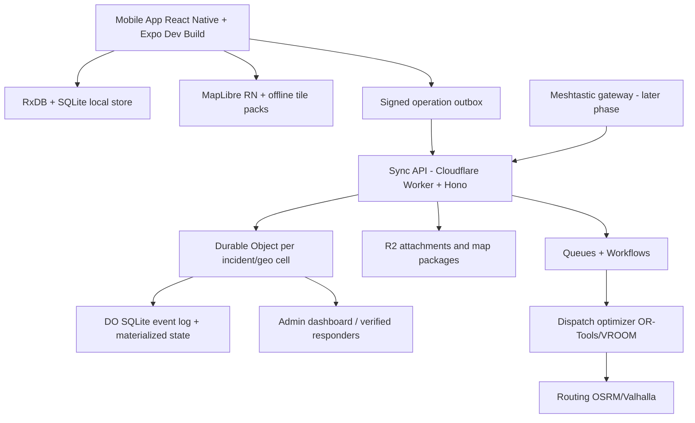

# Zona Cero - Benchmark técnico open source y arquitectura recomendada

**Fecha:** 2026-06-27  
**Contexto analizado:** PDF `Plan ZonaCero v02 27_06_2026.pdf` + investigación web/repositorios GitHub con metadatos actuales.  
**Stack objetivo:** React Native, Expo Development Builds, TypeScript, RxDB, SQLite/expo-sqlite, MapLibre; backend probable Cloudflare Workers, Hono, Durable Objects + SQLite, R2, Queues, Workflows, CDN, Better Auth.

> Conclusión directa: Zona Cero NO debe ser “una app con mapa”. Debe ser un sistema local-first de coordinación geoespacial basado en eventos firmados, sincronización tolerante a cortes, mapas offline y validación probabilística de presencia. El error serio sería confiar en GPS, backend online o identidad tradicional como fundamentos. Eso se rompe justo cuando más importa.

---

## 1. Resumen ejecutivo

### Recomendación principal

Construir Zona Cero como una **red local-first por incidente**, no como un CRUD móvil clásico:

- **App:** React Native + Expo Development Builds + TypeScript.
- **Base local:** RxDB sobre SQLite/expo-sqlite como primera opción pragmática; mantener una **cola append-only de operaciones firmadas** para sincronización, auditoría y resolución de conflictos.
- **Mapas:** MapLibre React Native + OSM vector tiles descargables por zona. Empezar con offline packs; evolucionar a paquetes regionales PMTiles/MBTiles generados con Planetiler/OpenMapTiles.
- **Sync:** protocolo propio, pequeño y explícito: `push/pull` por incidente + celda geográfica + cursor HLC/Lamport. Durable Object por incidente/celda como coordinador de consistencia eventual.
- **Backend:** Cloudflare Workers + Hono para API; Durable Objects + SQLite para estado caliente por incidente; R2 para adjuntos/mapas; Queues/Workflows para procesamiento asíncrono.
- **Identidad:** clave local Ed25519 por dispositivo/persona; seudónimo derivado; operaciones firmadas; Better Auth solo para personal verificado/admin, NO para voluntarios anónimos.
- **Presencia:** consenso probabilístico: geofencing + permanencia + múltiples dispositivos + reputación + límites anti-Sybil + señales de sensores. GPS solo es una señal, no una prueba.
- **Logística:** VROOM/OR-Tools + OSRM/Valhalla para dispatching y rutas.
- **Reunificación familiar:** integrar estándar PFIF/Google Person Finder como referencia; la app solo genera pistas. La entrega de menores debe cerrarse con Cruz Roja/protección de menores.

### Lo que conviene reutilizar directamente

1. **MapLibre React Native** para mapa móvil.
2. **RxDB** para base local reactiva y replicación inspiradora.
3. **OR-Tools / VROOM** para matching logístico y VRP.
4. **OSRM / Valhalla / GraphHopper** para rutas.
5. **PFIF / Google Person Finder** como modelo interoperable para personas desaparecidas.
6. **Meshtastic** como red LoRa externa/gateway, no como dependencia obligatoria del MVP.

### Lo que conviene tomar como ideas, no como código directo

- Ushahidi y Sahana Eden: excelentes referencias de dominio, pero stacks web/legacy pesados para el core móvil.
- Organic Maps/OsmAnd: muy buenos para offline maps, pero integrarlos completos en RN sería carísimo.
- Briar/Signal/Matrix/Session: patrones de identidad, transporte y seguridad, no arquitectura completa para Zona Cero.
- Pokémon GO/Waze/Foursquare: útiles como patrones de presencia/reputación, pero sus anti-abuso reales no son open source.

---

## 2. Comparativa tecnológica por decisión crítica

| Área | Mejor opción para Zona Cero | Alternativas | Decisión |
|---|---|---|---|
| Base local | **RxDB + SQLite/expo-sqlite** | WatermelonDB, Realm, SQLite manual | RxDB encaja mejor con documentos, reactividad, replicación y TypeScript. |
| Cola offline | **Outbox propia append-only** | TanStack Query offline, Legend State persist | Para catástrofes necesitas auditoría, firmas y resolución determinista; no basta una cache HTTP. |
| Sync | **Push/pull propio por incidente/celda** | PowerSync, ElectricSQL, Replicache | PowerSync/Electric brillan con Postgres; Cloudflare DO + SQLite empuja a sync propio. |
| Conflictos | **CRDT solo donde aporte** | LWW global, OT | Incidentes/logística/presencia son eventos; no metas CRDT por moda. CRDT para texto/notas/listas colaborativas. |
| Mapas | **MapLibre RN + OSM vector tiles offline** | react-native-maps, Organic Maps, OsmAnd | react-native-maps depende demasiado de proveedores online; Organic/OsmAnd son referencia, no SDK simple. |
| Routing | **Valhalla/OSRM + VROOM/OR-Tools** | GraphHopper | Elegir según perfil: OSRM rápido, Valhalla flexible, OR-Tools/VROOM para optimización. |
| Mesh | **Meshtastic como gateway posterior** | BLE mesh, Briar, Bridgefy | BLE mesh móvil consume batería y es frágil; LoRa sirve para coordinadores. |
| Identidad | **Clave local + firmas + reputación** | email/password, OAuth | El usuario civil no debe depender de proveedor de identidad. |
| Backend | **Workers + Hono + Durable Objects** | FastAPI/Postgres | Cloudflare encaja con edge y colas; para geoespacial pesado se puede añadir PostGIS luego. |
| Auth admin | **Better Auth solo para roles oficiales** | Auth0, Clerk | Separar identidad civil seudónima de acceso oficial. |

---

## 3. Benchmark por módulo

### Módulo 1 - Gestión de incidentes geolocalizados

**Repositorios clave:** Ushahidi, Sahana Eden, HOT Tasking Manager, HOT Field TM.

**Lecciones reutilizables:**

- **Modelo de datos:** incidentes/reportes con ubicación, categoría, estado, prioridad, fuente, adjuntos, historial y moderación.
- **Moderación:** estados tipo `pending -> verified -> rejected/archived`; trazabilidad de quién valida y por qué.
- **Visualización:** capas por categoría, heatmaps, clustering, filtros temporales y bounding boxes.
- **Sincronización:** ninguno resuelve perfectamente el offline móvil extremo que necesita Zona Cero. Aquí toca diseñar propio.

**Decisión:** tomar de Ushahidi/Sahana el modelo de dominio y flujos de moderación; construir el core móvil y sync desde cero.

### Módulo 2 - Validación colaborativa de presencia

No existe una implementación open source madura equivalente a Pokémon GO/Waze. CUIDADO: eso no significa que sea imposible; significa que no puedes venderlo como “GPS proof”.

**Arquitectura recomendada:**

- Check-in firmado con clave local.
- Geofence por centro con radio dinámico según precisión GPS.
- Permanencia: ventana temporal mínima, por ejemplo 60 minutos para pasar de observación a activo.
- Consenso ponderado: N dispositivos distintos, diversidad de claves, reputación, historial, precisión y señales de movimiento.
- Anti-spoofing: detección de mock location, jailbreak/root hints, velocidad imposible, saltos geográficos, precisión sospechosa, sensores inconsistentes.
- Anti-Sybil: coste temporal, límites por dispositivo, reputación local, atestaciones cruzadas, rate limits y umbrales por celda.

**Verdad incómoda:** en móviles de consumo no hay prueba criptográfica fuerte de presencia física. Hay **evidencia probabilística**. Diseñarlo como probabilidad y auditoría es arquitectura seria; prometer certeza sería mala ingeniería.

### Módulo 3 - Offline First

**Ranking técnico para Zona Cero:**

1. **RxDB + SQLite + outbox propia:** mejor equilibrio con React Native/Expo, TypeScript y control del protocolo.
2. **PowerSync:** muy fuerte si aceptas Postgres como fuente de verdad; menos natural con Cloudflare DO SQLite.
3. **ElectricSQL:** arquitectura local-first interesante, shapes potentes; validar bien React Native y operación en producción.
4. **WatermelonDB:** robusta, pero más rígida y menos alineada con replicación personalizada moderna.
5. **Realm:** base móvil fuerte, pero cuidado con dependencia de ecosistema MongoDB/Sync y cambios de producto.
6. **TanStack Query Offline:** útil para cache/mutations simples, no para el core offline de catástrofes.
7. **SQLite + cola propia:** viable, máximo control, pero escribirías demasiado desde cero.

**Modelo recomendado:**

- Local DB con colecciones: `incidents`, `work_centers`, `presence_sessions`, `resource_reports`, `dispatch_jobs`, `family_records_public`, `family_claims_private`, `attachments`, `sync_ops`.
- Cada mutación genera una operación firmada:
  - `op_id`, `actor_key`, `device_id`, `incident_id`, `geo_cell`, `entity_type`, `entity_id`, `op_type`, `payload`, `hlc`, `signature`.
- Materializadores locales actualizan vistas consultables.
- Sync sube operaciones idempotentes y baja operaciones nuevas por cursor.

### Módulo 4 - Mapas offline

**Decisión:** MapLibre React Native como SDK móvil. Organic Maps/OsmAnd como referencia de UX offline, no como dependencia directa.

**Pipeline recomendado:**

1. OSM extract regional.
2. Generar vector tiles con Planetiler/OpenMapTiles.
3. Servir tiles con TileServer GL/CDN.
4. Empaquetar zonas críticas con PMTiles/MBTiles.
5. App descarga paquetes por incidente antes o durante conectividad intermitente.
6. Routing online/offline según fase: backend OSRM/Valhalla primero; rutas offline compactas después.

### Módulo 5 - Redes mesh

**Comparativa:**

| Opción | Utilidad | Problema |
|---|---|---|
| BLE mesh móvil | Teléfono a teléfono sin hardware | Batería, iOS/Android restricciones, alcance bajo, fiabilidad irregular. |
| Bridgefy | SDK de mesh móvil | Dependencia propietaria/SDK, revisar seguridad/licencia antes de apostar. |
| Briar | Arquitectura P2P segura | App propia Java/Android; buena referencia, difícil de integrar en Expo. |
| Meshtastic/LoRa | Larga distancia con hardware barato | Requiere radios; perfecto para coordinadores/gateways, no para todos. |
| WiFi Direct | Alto ancho de banda local | UX y compatibilidad complicadas. |
| SMS/USSD | Último recurso | Muy bajo ancho de banda, integración variable por país. |

**Decisión:** MVP offline-first sin mesh. Fase 3: Meshtastic gateway para mensajes mínimos: SOS, centro activo, faltante crítico, ACK.

### Módulo 6 - Logística

**Motor recomendado:**

- Fase 1: matching simple oferta-demanda por prioridad, distancia, criticidad y capacidad.
- Fase 2: VROOM + OSRM/Valhalla para rutas multi-parada.
- Fase 3: OR-Tools para restricciones complejas: capacidades, ventanas temporales, prioridades, vehículos, habilidades.

**No copies Uber.** Para catástrofes no optimizas revenue ni ETA comercial; optimizas impacto, seguridad y criticidad.

### Módulo 7 - Reunificación familiar

**Referencia fuerte:** Google Person Finder + PFIF; RFL/Trace The Face como marco operativo/humanitario.

**Diseño recomendado:**

- Capa pública mínima: nombre + iniciales, sin foto pública, sin ubicación exacta.
- Capa privada cifrada: identidad completa, descripción, ubicación precisa, registrante, auditoría.
- Matching tipo búsqueda ciega: quien busca debe demostrar conocimiento previo.
- La app nunca autoriza entrega de menor. Solo deriva a verificación presencial.
- TTL, límites de intentos, auditoría, personal verificado y protocolos con Cruz Roja/protección de menores.

### Módulo 8 - Identidad descentralizada

**Patrón recomendado:**

- Al instalar: generar clave Ed25519 local.
- Crear seudónimo estable por incidente, no global si hay riesgo político.
- Firmar cada operación.
- Reputación contextual: presencia validada, antigüedad dentro del incidente, atestaciones, rol verificado.
- Confianza por niveles:
  - anónimo local,
  - voluntario observado,
  - voluntario activo,
  - rol validado,
  - organización oficial.

**Tomar ideas de:** Signal/libsignal para criptografía, Briar para P2P seguro, Matrix para federación, Session/Meshtastic para identidad sin proveedor central. No montar Matrix completo para MVP: sería una losa.

### Módulo 9 - React Native + Expo

Busqué referencias maduras con **Expo + Expo Router + FastAPI + PostgreSQL** y la realidad es clara: lo que aparece son plantillas pequeñas o proyectos personales con poca tracción. No conviene basar una arquitectura senior en eso.

**Referencias mejores:**

- `expo/expo`: integración Expo real.
- `infinitered/ignite`: estructura RN profesional.
- `Expensify/App`: app RN grande, producción, offline-heavy.
- `fastapi/full-stack-fastapi-template`: backend FastAPI/Postgres si finalmente se elige ese camino.
- `honojs/hono` + `cloudflare/workers-sdk`: más alineado con el backend Cloudflare propuesto.

### Módulo 10 - Arquitectura final recomendada

---

## 4. Ranking de los 30 repositorios GitHub más útiles

> Metadatos consultados vía GitHub el 2026-06-27. “Última actividad” usa `pushed_at`; para valorar producción hay que revisar releases/issues antes de adoptar.

| # | Repositorio | Módulo | Licencia | Stars | Última actividad | Lenguaje | Reutilización recomendada |
|---:|---|---|---|---:|---|---|---|
| 1 | [pubkey/rxdb](https://github.com/pubkey/rxdb) | Offline DB/sync | Apache-2.0 | 23,238 | 2026-06-27 | TypeScript | Código directo para DB local; adaptar replicación. |
| 2 | [maplibre/maplibre-react-native](https://github.com/maplibre/maplibre-react-native) | Mapas móvil | MIT | 627 | 2026-06-27 | TypeScript | Código directo para mapa, offline packs y ubicación. |
| 3 | [google/or-tools](https://github.com/google/or-tools) | Optimización logística | Apache-2.0 | 13,690 | 2026-06-26 | C++ | Código directo en backend para matching/VRP. |
| 4 | [VROOM-Project/vroom](https://github.com/VROOM-Project/vroom) | VRP/dispatch | BSD-2-Clause | 1,791 | 2026-05-11 | C++ | Código directo como servicio de routing/dispatch. |
| 5 | [Project-OSRM/osrm-backend](https://github.com/Project-OSRM/osrm-backend) | Routing | BSD-2-Clause | 7,833 | 2026-06-27 | C++ | Servicio de rutas rápido. |
| 6 | [valhalla/valhalla](https://github.com/valhalla/valhalla) | Routing multimodal | MIT | 5,858 | 2026-06-27 | C++ | Servicio de rutas flexible. |
| 7 | [organicmaps/organicmaps](https://github.com/organicmaps/organicmaps) | Mapas offline | Apache-2.0 | 14,422 | 2026-06-27 | C++ | Ideas/pipeline UX; no integrar completo. |
| 8 | [osmandapp/OsmAnd](https://github.com/osmandapp/OsmAnd) | Mapas offline | GPL-3.0 | 5,803 | 2026-06-27 | Java | Ideas de navegación offline; cuidado GPL. |
| 9 | [meshtastic/firmware](https://github.com/meshtastic/firmware) | LoRa mesh | GPL-3.0 | 7,826 | 2026-06-27 | C++ | Gateway/hardware, no core móvil. |
| 10 | [signalapp/libsignal](https://github.com/signalapp/libsignal) | Criptografía | AGPL-3.0 | 5,860 | 2026-06-25 | Rust | Primitivas/patrones; revisar AGPL. |
| 11 | [briar/briar](https://github.com/briar/briar) | P2P seguro | GPL-3.0 | 643 | 2026-06-26 | Java | Ideas de transporte/threat model. |
| 12 | [google/personfinder](https://github.com/google/personfinder) | Reunificación/PFIF | Apache-2.0 | 545 | 2024-07-15 | Python | Modelo PFIF y lógica de personas; no UX móvil. |
| 13 | [ushahidi/platform](https://github.com/ushahidi/platform) | Incidentes | AGPL-3.0 | 726 | 2026-04-21 | PHP | Modelo/moderación; no copiar backend. |
| 14 | [sahana/eden](https://github.com/sahana/eden) | Disaster management | MIT | 26 | 2026-06-13 | Python | Dominio y módulos; comunidad pequeña. |
| 15 | [hotosm/tasking-manager](https://github.com/hotosm/tasking-manager) | Geo-tareas voluntarios | BSD-2-Clause | 586 | 2026-06-26 | Python | Flujos de tasking y validación. |
| 16 | [powersync-ja/powersync-js](https://github.com/powersync-ja/powersync-js) | Offline sync | Apache-2.0 | 680 | 2026-06-26 | TypeScript | Ideas o adopción si se usa Postgres. |
| 17 | [electric-sql/electric](https://github.com/electric-sql/electric) | Local-first sync | Apache-2.0 | 10,244 | 2026-06-26 | TypeScript | Ideas de shapes/sync; validar RN. |
| 18 | [Nozbe/WatermelonDB](https://github.com/Nozbe/WatermelonDB) | RN DB | MIT | 11,736 | 2025-08-11 | JavaScript | Alternativa si RxDB no rinde. |
| 19 | [vlcn-io/cr-sqlite](https://github.com/vlcn-io/cr-sqlite) | CRDT SQLite | MIT | 3,738 | 2024-10-25 | Rust | Ideas para merges; integración RN compleja. |
| 20 | [automerge/automerge](https://github.com/automerge/automerge) | CRDT | MIT | 6,376 | 2026-06-22 | JavaScript | Reutilizar para documentos colaborativos puntuales. |
| 21 | [yjs/yjs](https://github.com/yjs/yjs) | CRDT | MIT | 22,084 | 2026-06-22 | JavaScript | Útil para texto/listas; no core geoespacial. |
| 22 | [Expensify/App](https://github.com/Expensify/App) | RN producción | MIT | 4,921 | 2026-06-27 | TypeScript | Referencia de escala, offline y estructura. |
| 23 | [osm-search/Nominatim](https://github.com/osm-search/Nominatim) | Geocoding | GPL-3.0 | 4,350 | 2026-06-26 | Python | Servicio backend; no app móvil. |
| 24 | [maptiler/tileserver-gl](https://github.com/maptiler/tileserver-gl) | Tiles | BSD-2-Clause | 2,839 | 2026-06-25 | JavaScript | Servir MBTiles/vector tiles. |
| 25 | [protomaps/PMTiles](https://github.com/protomaps/PMTiles) | Tile packaging | BSD-3-Clause/CC0 spec | 2,915 | 2026-05-26 | TypeScript | Paquetes offline/CDN eficientes. |
| 26 | [graphhopper/graphhopper](https://github.com/graphhopper/graphhopper) | Routing | Apache-2.0 | 6,535 | 2026-06-26 | Java | Routing/optimización alternativa. |
| 27 | [opencrvs/opencrvs-core](https://github.com/opencrvs/opencrvs-core) | Registro civil | MPL-2.0 | 117 | 2026-06-25 | TypeScript | Gobernanza de identidad/datos sensibles. |
| 28 | [element-hq/synapse](https://github.com/element-hq/synapse) | Federación | AGPL-3.0 | 4,322 | 2026-06-27 | Python | Ideas de federación; demasiado pesado para MVP. |
| 29 | [expo/expo](https://github.com/expo/expo) | RN/Expo | MIT | 50,308 | 2026-06-27 | TypeScript | Plataforma base. |
| 30 | [infinitered/ignite](https://github.com/infinitered/ignite) | RN arquitectura | NOASSERTION | 19,857 | 2026-06-07 | TypeScript | Estructura de proyecto y convenciones. |

---

## 5. Calidad, comunidad y mantenimiento - lectura rápida

| Grupo | Actividad | Comunidad | Calidad código/docs | Riesgo |
|---|---|---|---|---|
| RxDB, Expo, TanStack, Hono, Cloudflare SDK | Muy alta | Muy alta | Alta | Cambios rápidos; fijar versiones. |
| MapLibre RN | Alta pero comunidad más pequeña | Media | Buena | Probar offline packs en iOS/Android temprano. |
| Organic Maps/OsmAnd | Muy alta | Alta | Alta | Código nativo grande; licencias y complejidad. |
| OR-Tools/VROOM/OSRM/Valhalla | Alta | Alta | Alta | Operación pesada fuera de Workers; usar servicios separados si hace falta. |
| Ushahidi/Sahana | Media/variable | Histórica | Variable | Buen dominio, menor encaje técnico moderno. |
| Person Finder/PFIF | Baja-media | Histórica | Correcta | Más estándar/referencia que producto activo. |
| Briar/Meshtastic/Signal | Alta en su nicho | Fuerte | Alta | Licencias copyleft y dificultad de integración móvil/Expo. |

---

## 6. Ranking de 20 librerías React Native/Expo imprescindibles

1. `expo` - plataforma base.
2. `expo-router` - routing file-based.
3. `expo-dev-client` - development builds y módulos nativos.
4. `expo-sqlite` - SQLite local.
5. `rxdb` - base local reactiva/offline-first.
6. `@maplibre/maplibre-react-native` - mapas.
7. `expo-location` - ubicación foreground/background.
8. `expo-task-manager` - tareas background.
9. `react-native-permissions` - permisos finos.
10. `react-native-mmkv` - storage KV rápido para settings/keys no sensibles.
11. `expo-secure-store` o Keychain/Keystore nativo - material criptográfico.
12. `@tanstack/react-query` - server state no crítico.
13. `legend-state` - estado local UI si se quiere alta reactividad.
14. `react-native-reanimated` - UI fluida.
15. `react-native-gesture-handler` - interacción mapa/listas.
16. `react-native-background-fetch` - jobs periódicos, revisar restricciones OS.
17. `expo-crypto` / librería Ed25519 auditada - firmas.
18. `sentry-expo` / Sentry RN - crash/error reporting.
19. `maestro` o Detox - E2E móvil.
20. `zod` - validación de payloads/oplog.

---

## 7. Ranking de 10 investigaciones académicas relevantes

1. **Local-first software** - Kleppmann et al./Ink & Switch. Base conceptual para software útil sin nube permanente.
2. **Conflict-free Replicated Data Types** - Shapiro et al. Fundamento de CRDTs.
3. **A comprehensive study of CRDTs** - Shapiro/Preguiça/Baquero/Zawirski. Taxonomía y semánticas de convergencia.
4. **Bayou replicated database services** - Terry et al. Operación desconectada y resolución de conflictos.
5. **Dynamo: Amazon's highly available key-value store** - DeCandia et al. Eventual consistency y conflictos en producción.
6. **Coda File System / disconnected operation** - Satyanarayanan et al. Offline real antes de que se llamara local-first.
7. **Practical Byzantine Fault Tolerance** - Castro/Liskov. Relevante para pensar consenso adversarial, no para implementarlo tal cual.
8. **SybilGuard** - Yu et al. Defensa contra identidades falsas usando grafos sociales.
9. **SybilLimit** - Yu et al. Límites casi óptimos contra Sybil attacks.
10. **APPLAUS / location proof systems** - pruebas de ubicación con privacidad; útil para entender límites de presencia física.

---

## 8. Componentes que merece la pena reutilizar

- MapLibre RN: mapa móvil.
- RxDB: DB local y patrones de replicación.
- OR-Tools/VROOM: optimización logística.
- OSRM/Valhalla/GraphHopper: rutas.
- TileServer GL/PMTiles/Planetiler: pipeline de mapas.
- PFIF/Person Finder: interoperabilidad de personas desaparecidas.
- Meshtastic: gateway resiliente para coordinadores.
- libsignal: patrones criptográficos si la licencia/integación encajan.

## 9. Componentes que es preferible desarrollar desde cero

- Protocolo de presencia/consenso de centros de trabajo.
- Sync específico por incidente/celda sobre Durable Objects.
- Reputación contextual y anti-Sybil adaptado a catástrofes.
- Modelo de operaciones firmadas y auditoría.
- UX de voluntariado, centros de trabajo, SOS y logística.
- Flujo seguro de reunificación infantil; puedes interoperar con PFIF, pero NO delegar la responsabilidad de producto.

---

## 10. Roadmap de implementación

### Fase 0 - Spike técnico, 2-3 semanas

- Expo Dev Build con MapLibre RN.
- RxDB + SQLite/expo-sqlite.
- Outbox firmada local.
- Worker/Hono + Durable Object por incidente.
- Sync push/pull mínimo.
- Descargar paquete de mapas de prueba.

### Fase 1 - MVP real

- Registro seudónimo local.
- Crear centro de trabajo.
- Check-in geográfico.
- Estado `pending -> observing -> active`.
- Mapa vivo offline/online.
- Moderación básica y auditoría.

### Fase 2 - Logística

- Reportes de faltantes/sobrantes.
- Matching simple.
- Dispatch manual asistido.
- Integrar VROOM/OR-Tools cuando haya volumen.

### Fase 3 - Resiliencia

- SOS con última ubicación + baliza local.
- Integración Meshtastic gateway.
- Modo bajo consumo.
- Pruebas de red degradada.

### Fase 4 - Reunificación familiar

- PFIF-compatible.
- Capa pública mínima.
- Capa privada cifrada.
- Auditoría y límites de intentos.
- Acuerdos operativos con Cruz Roja/protección de menores antes de producción.

---

## 11. Riesgos principales

1. **Falsa seguridad de presencia:** GPS spoofing existe. Mitigar con scoring, no con promesas absolutas.
2. **Batería:** GPS/BLE constantes matan el móvil. Muestreo adaptativo obligatorio.
3. **Licencias copyleft:** Ushahidi AGPL, Signal AGPL, Briar GPL, OsmAnd GPL. Revisar antes de copiar código.
4. **Cloudflare + geoespacial pesado:** Workers no son ideales para routing/VRP intensivo. Separar servicios pesados.
5. **Datos sensibles de menores:** riesgo legal/humano máximo. La app no debe autorizar entregas.
6. **Offline conflict hell:** si no se diseña el oplog desde el día 1, luego se paga carísimo.
7. **Mesh fantasioso:** BLE mesh suena bien en pitch; en campo puede fallar por batería, permisos y densidad.
8. **Voluntarios no entrenados:** la app debe coordinar, no incentivar entrada en zonas inseguras.

---

## 12. Fuentes principales

- GitHub metadata consultada: ver `zona_cero_github_metadata_2026-06-27.json`.
- RxDB React Native/Expo docs: https://rxdb.info/react-native-database.html
- RxDB SQLite storage docs: https://rxdb.info/rx-storage-sqlite.html
- Expo Development Builds: https://docs.expo.dev/develop/development-builds/introduction/
- Expo SQLite: https://docs.expo.dev/versions/latest/sdk/sqlite/
- MapLibre React Native: https://github.com/maplibre/maplibre-react-native
- MapLibre Offline Manager docs: https://github.com/maplibre/maplibre-react-native/blob/main/docs/content/modules/offline-manager.md
- Cloudflare Durable Objects: https://developers.cloudflare.com/durable-objects/
- Hono: https://github.com/honojs/hono
- Meshtastic overview: https://meshtastic.org/docs/overview/
- Briar architecture: https://briarproject.org/how-it-works/
- Google OR-Tools VRP docs: https://developers.google.com/optimization/routing/vrp
- Google Person Finder: https://github.com/google/personfinder
- PFIF schema: https://github.com/google/personfinder/blob/master/app/resources/pfif-1.4.xsd
- Local-first software: https://www.inkandswitch.com/local-first/
- CRDT reference material: https://hal.inria.fr/inria-00555588/document
- Dynamo paper: https://www.allthingsdistributed.com/files/amazon-dynamo-sosp2007.pdf
- SybilGuard: https://www.cs.cornell.edu/people/egs/sybilguard-sigcomm06.pdf
