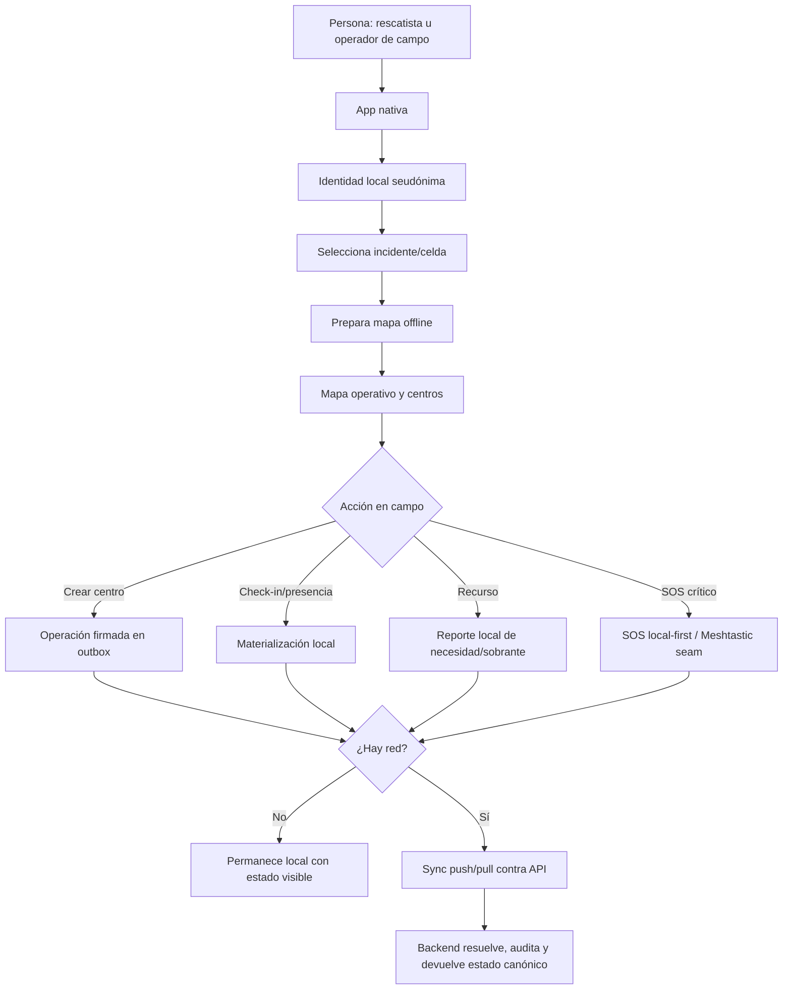
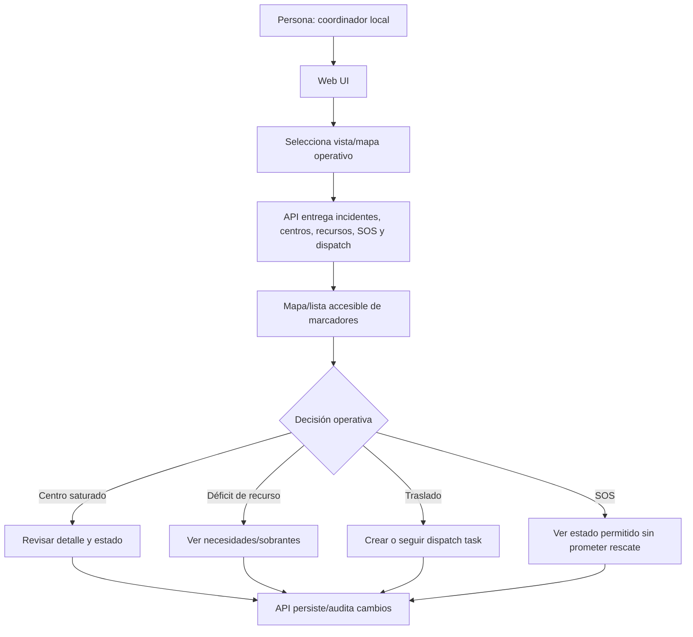
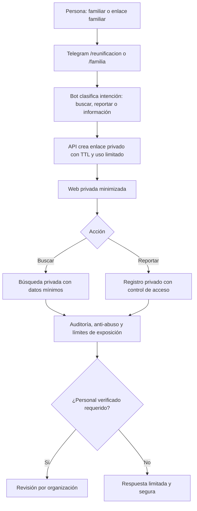
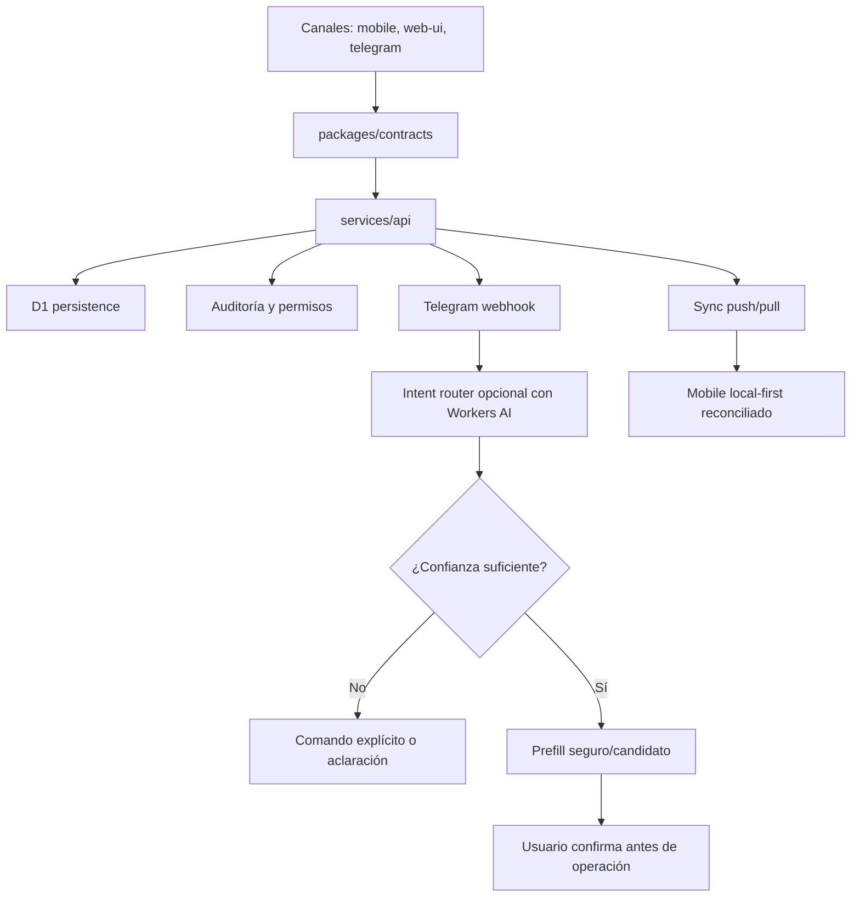

# Wireflows por persona y canal - Zona Cero

Este documento cruza los PRDs, transcripciones, checklist de slices, código y pruebas existentes para entender qué flujos están cubiertos, cuáles están parciales y qué falta verificar antes de decir que el producto está terminado.

> Lectura importante: estos wireflows no sustituyen a una ejecución fresca de tests o smoke tests. Separan **evidencia existente** de **verificación ejecutada en esta revisión** para evitar vender como terminado algo que solo está documentado.

## Resumen ejecutivo

Zona Cero ya tiene una base multi-canal fuerte: Telegram, Web UI, API, contratos compartidos y una base nativa offline-first con outbox, sync, mapas y SOS. Aun así, el estado no debe leerse como "todo terminado" sin matices.

| Área | Estado de producto | Lectura honesta |
|---|---|---|
| Telegram + Web UI + API | Avanzado | Cubre onboarding, reportes, recursos, dispatch, SOS conectado, reunificación privada y routing de intención. |
| App nativa | Parcial/avanzado por capacidades | Tiene piezas offline-first importantes, pero varios puntos siguen dependiendo de seams/dev-build o de validación nativa real. |
| Reunificación familiar | Parcial por canal | Implementada sobre Telegram/Web/API; explícitamente fuera del SOS nativo. |
| IA operativa | Parcial/controlada | Existe clasificación/prefill seguro en Telegram; no debe tratarse como autoridad operativa. |
| Verificación actual | Ejecutada parcialmente en esta revisión | Se ejecutaron suites locales focalizadas de contracts, API intent/webhook y Telegram channel; staging/campo siguen pendientes. |
| Checklist de slices | Reconciliado parcialmente | La tabla global ya alinea slices 11, 13, 14, 15 y 19 con sus cierres/evidencia; Slice 12 conserva Equipo C pendiente. |

## Cómo leer los estados

| Estado | Regla |
|---|---|
| `implemented` | Hay implementación y evidencia de prueba automatizada existente; la verificación fresca se indica por separado. |
| `partial` | Hay implementación o prueba, pero falta cobertura completa de canal, E2E, staging, hardware o smoke real. |
| `planned` | Está en PRD, briefing o backlog, pero no hay implementación clara. |
| `unverified` | Parece implementado, pero no se ejecutó verificación fresca en esta revisión. |

## Fuentes usadas

| Fuente | Uso en este mapa |
|---|---|
| `docs/zona_cero_prd_funcional.md` | PRD funcional, personas, módulos y roadmap. |
| `docs/zona_cero_telegram_web_ui_prd.md` | Alcance de Telegram + Web UI. |
| `docs/zona_cero_telegram_web_ui_matrix.md` | Matriz de qué puede cubrir Telegram/Web y qué requiere app nativa. |
| `docs/zona_cero_delivery_slices_checklist.md` | Estado declarado por slice/equipo. |
| `docs/zona_cero_native_app_scope.md` | Responsabilidad de app nativa: offline, presencia, SOS crítico y outbox. |
| `docs/zona_cero_screen_design.md` | Flujo visual mobile esperado. |
| `docs/ideas/ideas_relevantes_zona_cero.md` | Síntesis de transcripciones y decisiones de producto. |
| `docs/ideas/transcriptions/*.txt` | Briefings/transcripciones originales. |
| `docs/zona_cero_threat_model_matrix.md` | Riesgos, actores maliciosos y límites de seguridad. |
| `docs/zona_cero_api_contracts.md` | Contratos por canal y operaciones compartidas. |
| `docs/zona_cero_backend_capabilities.md` | Capacidades backend y ownership. |

## Personas principales

| Persona | Necesidad principal | Canal dominante | Canales de apoyo |
|---|---|---|---|
| Voluntario de campo | Reportar estado, necesidades, centros y disponibilidad bajo estrés. | App nativa / Telegram | Web UI |
| Rescatista u operador crítico | Operar offline, enviar SOS, mantener presencia y sincronizar después. | App nativa | API |
| Coordinador local | Ver mapa, priorizar centros, reasignar recursos y coordinar tareas. | Web UI | Telegram |
| Logística / motorizado | Reportar faltantes/sobrantes, aceptar traslados y cerrar entregas. | Telegram | Web UI / App nativa |
| Familiar o enlace familiar | Buscar o reportar información sensible con minimización de datos. | Web privada | Telegram |
| Personal verificado de organización | Revisar casos sensibles, validar accesos y evitar abuso. | Web UI / API | Telegram |
| Plataforma/API | Mantener contratos, auditoría, permisos, persistencia y fan-out. | API | Contratos compartidos |

## Wireflow 1: voluntario Telegram - alta y reportes rápidos

```mermaid
flowchart TD
  A[Persona: voluntario civil] --> B[Telegram /start]
  B --> C[Selecciona incidente, seudónimo, rol e idioma]
  C --> D{¿Qué necesita reportar?}
  D -->|Centro| E[/workcenter o lenguaje natural]
  D -->|Recurso| F[/resource o lenguaje natural]
  D -->|SOS con red| G[/sos con confirmación fuerte]
  D -->|Reunificación| H[/reunificacion o /familia]
  E --> I[API valida y persiste centro]
  F --> J[API registra necesidad/sobrante y recomienda matches]
  G --> K[API crea alerta SOS y devuelve acuse honesto]
  H --> L[API genera enlace web privado minimizado]
  I --> M[Web UI/API muestran estado]
  J --> M
  K --> M
  L --> N[Web privada de búsqueda/reporte]
```

| Paso | Estado | Evidencia existente | Falta para afirmar "terminado" |
|---|---|---|---|
| `/start` e incident join | `implemented` | `apps/telegram-channel/src/incident-join-flow.ts`, `services/api/src/index.ts`, tests de Telegram/API. | Ejecutar smoke fresco. |
| `/workcenter` | `implemented` | `work-center-flow.ts`, API work centers, E2E operational map. | Verificar staging si se va a enseñar a usuarios. |
| `/resource` | `implemented` | `resource-flow.ts`, tests Telegram/API/contracts. | Falta comando dry-run targeted dedicado. |
| `/sos` conectado | `implemented` | `sos-flow.ts`, API SOS, staging Telegram spec. | Confirmar secrets/webhook/staging reales. |
| `/reunificacion` | `implemented`/`partial` | `family-reunification-flow.ts`, private link API/Web. | Requiere organismo verificador antes de producción real. |
| Lenguaje natural con IA | `partial` | `services/api/src/telegram-intent-classifier.ts`, tests de intent router. | Mantener como prefill/candidate, nunca autoridad operativa. |

## Wireflow 2: operador de campo mobile - operación offline-first



| Paso | Estado | Evidencia existente | Falta para afirmar "terminado" |
|---|---|---|---|
| Onboarding local/remoto | `implemented` | `apps/mobile/src/features/incidents/local-onboarding.ts`, tests. | Smoke nativo fresco. |
| Outbox firmado/materializer | `implemented` | `outbox-service.ts`, `materializer.ts`, `operation-signer` tests. | Validación con datos reales de campo. |
| Sync scoped | `implemented` | `sync-service.ts`, `sync-client.ts`, API sync tests. | Verificación staging. |
| Mapas offline | `partial` | `offline-map-packs.ts`, `maplibre-adapter.ts`, tests. | Prueba real de descarga/render nativo de tiles. |
| Presencia | `implemented`/`partial` | `liveOperations.tsx`, materializer tests. | Validar background/sensores/batería en dispositivo. |
| SOS crítico/offline | `partial` | SOS local, outbox, Meshtastic seam tests. | Prueba hardware/operativa real; Telegram no sustituye este flujo. |
| Reunificación en mobile | `planned`/fuera de scope | Tests indican que se mantiene fuera del SOS nativo. | Decisión explícita si producto quiere llevarlo a mobile. |

## Wireflow 3: coordinador Web UI - mapa operativo y decisión



| Paso | Estado | Evidencia existente | Falta para afirmar "terminado" |
|---|---|---|---|
| Mapa operativo Web | `implemented` | `apps/web-ui/src/features/operations-map/*`, `e2e/operational-map.spec.ts`. | Smoke visual fresco. |
| Centros de trabajo | `implemented` | Web/API contracts integration, API index tests. | Verificar contra staging. |
| Recursos y dispatch | `implemented` | API, Telegram, contracts tests. | Confirmar flujo completo cross-channel con datos actuales. |
| SOS visible con cautela | `implemented`/`partial` | API/Web/Telegram tests. | Revisión UX/legal de promesas y copy. |
| Recomendación operacional general | `planned`/`partial` | Hay matching/recomendaciones acotadas; no motor general claro. | Definir alcance producto antes de construir más. |

## Wireflow 4: logística - matching y tareas de traslado

```mermaid
flowchart TD
  A[Persona: logística o motorizado] --> B{Canal inicial}
  B -->|Telegram| C[/resource o /dispatch]
  B -->|Web UI| D[Panel operativo]
  B -->|Mobile| E[Reporte offline/local]
  C --> F[API registra recurso o tarea]
  D --> F
  E --> G[Outbox y sync]
  G --> F
  F --> H[Contratos normalizan categoría, cantidad, ubicación y estado]
  H --> I[Matching faltante/sobrante o dispatch task]
  I --> J[Estados: pending, accepted, en_route, delivered, cancelled]
  J --> K[Auditoría y vista compartida]
```

| Paso | Estado | Evidencia existente | Falta para afirmar "terminado" |
|---|---|---|---|
| Reporte de recurso | `implemented` | Telegram resource flow, API, contracts. | Dry-run targeted dedicado. |
| Dispatch task | `implemented` | Telegram dispatch flow, API tests, contracts. | Staging Telegram real si se usa en demo. |
| Mobile recursos/dispatch local | `implemented`/`partial` | Mobile materializer/live operations tests. | Validar UX en dispositivo y sync real. |
| Matching avanzado | `partial` | Hay matching de necesidades; motor general no claramente implementado. | Alinear PRD: determinístico, IA o backlog. |

## Wireflow 5: SOS - confirmación, acuse y límites de promesa

```mermaid
flowchart TD
  A[Persona: afectado, voluntario o rescatista] --> B{Canal}
  B -->|Telegram con red| C[/sos o lenguaje natural]
  B -->|Mobile offline/degradado| D[SOS local-first]
  B -->|Web| E[Formulario/acción conectada si aplica]
  C --> F[Confirmación fuerte antes de crear alerta]
  E --> F
  D --> G[Outbox local / señal degradada / Meshtastic seam]
  F --> H[API crea alerta, audita y devuelve acuse honesto]
  G --> I{¿Conectividad disponible?}
  I -->|No| J[Estado local: pendiente/degradado]
  I -->|Sí| H
  H --> K[Fan-out/estado visible sin prometer rescate]
```

| Paso | Estado | Evidencia existente | Falta para afirmar "terminado" |
|---|---|---|---|
| SOS Telegram conectado | `implemented` | `sos-flow.ts`, API tests, staging spec. | Validar webhook/staging real. |
| SOS mobile local-first | `partial` | Mobile SOS/outbox/materializer/Meshtastic tests. | Hardware y operación real. |
| Acuse honesto | `implemented` | Tests/copy de canal; docs insisten en no prometer rescate. | Revisión final de UX/legal. |
| Ubicación exacta/profundidad | `planned`/rechazado como promesa | Briefings lo sugieren; docs exigen radio/timestamp y cautela. | Decisión producto: no prometer precisión falsa. |

## Wireflow 6: reunificación familiar - privacidad y enlace seguro



| Paso | Estado | Evidencia existente | Falta para afirmar "terminado" |
|---|---|---|---|
| Telegram inicia flujo | `implemented` | `family-reunification-flow.ts`, tests. | Smoke fresco. |
| Enlace privado web | `implemented` | API private links, Web UI, contracts. | Verificar staging y expiración real. |
| Minimización de datos | `implemented`/`partial` | PRD/threat model/API tests. | Revisión con organización civil antes de producción. |
| Organismo verificador | `planned`/proceso externo | Producto lo exige como control operativo. | No lanzar producción sin gobernanza. |
| Mobile reunificación | `planned`/fuera de scope actual | Explícitamente mantenido fuera del SOS nativo. | Decidir si conviene o no. |

## Wireflow 7: plataforma/API - contrato común entre canales



| Paso | Estado | Evidencia existente | Falta para afirmar "terminado" |
|---|---|---|---|
| Contratos compartidos | `implemented` | `packages/contracts/src/index.ts`, tests. | Mantener política de breaking changes. |
| API operacional | `implemented` | `services/api/src/index.ts`, API/integration tests. | Deploy/staging smoke. |
| Telegram webhook | `implemented` | `/telegram/webhook`, channel tests. | Registro webhook/secrets fuera del repo. |
| Intent router | `partial` | `telegram-intent-classifier.ts`, tests. | Mantener como ayuda, no decisión automática. |
| Sync mobile | `implemented`/`partial` | Sync service/API tests. | Verificación con cliente nativo real. |

## Matriz persona x canal x estado

| Persona / flujo | Telegram | Web UI | Mobile | API/contracts | Estado global |
|---|---|---|---|---|---|
| Alta a incidente | `implemented` | `partial` | `implemented` | `implemented` | `implemented` |
| Reporte de centro | `implemented` | `implemented` | `implemented` | `implemented` | `implemented` |
| Recursos faltantes/sobrantes | `implemented` | `implemented` | `implemented`/`partial` | `implemented` | `implemented`/`partial` |
| Dispatch/logística | `implemented` | `implemented` | `implemented`/`partial` | `implemented` | `implemented`/`partial` |
| SOS conectado | `implemented` | `implemented`/`partial` | `partial` | `implemented` | `partial` |
| SOS offline/degradado | No aplica | No aplica | `partial` | `partial` | `partial` |
| Reunificación familiar | `implemented` | `implemented` | Fuera de scope | `implemented` | `partial` por gobernanza |
| Mapa operativo online | Apoyo | `implemented` | `implemented`/`partial` | `implemented` | `implemented`/`partial` |
| Mapa offline | No aplica | No aplica | `partial` | Apoyo | `partial` |
| Presencia probabilística | No aplica/parcial | Visualización parcial | `partial` | `partial` | `partial` |
| IA de intención Telegram | `partial` | No aplica | No aplica | `partial` | `partial` |
| Multimedia/evidencia foto-video | `planned` | `planned` | `planned` | `planned` | `planned` |
| Alertas oficiales/trusted feeds | `planned` | `planned` | `planned` | `planned` | `planned` |

## Contradicciones y riesgos encontrados

| Riesgo | Impacto | Acción recomendada |
|---|---|---|
| Slice 12 conserva Equipo C como pendiente aunque el estado global sea `Implementado`. | Puede parecer cierre total mobile cuando la evidencia principal es Telegram/API. | Definir si Equipo C debe validar compatibilidad o si corresponde marcarlo como `N/A`. |
| Telegram/Web no sustituyen el núcleo nativo offline-first. | Riesgo de prometer resiliencia que el canal conectado no puede dar. | Mantener separación explícita por canal. |
| Reunificación familiar existe técnicamente, pero necesita gobernanza. | Riesgo legal/ético si se lanza sin organización verificadora. | Marcar como feature sensible con gate operativo. |
| IA aparece en briefings como deseo amplio. | Riesgo de usar IA como autoridad en zona de peligro. | Limitar a clasificación/prefill y exigir confirmación humana. |
| Mobile tiene seams/dev-build para capacidades nativas. | Riesgo de confundir pruebas unitarias con readiness de campo. | Añadir smoke real de dispositivo/hardware antes de demo fuerte. |

## Verificación recomendada

Durante esta reconciliación documental se ejecutaron suites focalizadas de contracts, API intent/webhook y Telegram channel. Para convertir todo `implemented` en "verificado hoy" por canal, completar:

| Área | Comando |
|---|---|
| Gate raíz | `pnpm test:strict` |
| Contracts | `pnpm contracts:test:strict` |
| API | `pnpm api:test:strict` |
| Web UI | `pnpm web:test:strict` |
| Mobile | `pnpm mobile:test:strict` |
| Telegram | `pnpm telegram:test:strict` |
| E2E local | `pnpm e2e` |
| Mapa operativo E2E | `pnpm exec playwright test e2e/operational-map.spec.ts` |
| Telegram dry-run | `pnpm e2e:telegram:dry-run` |
| Telegram incident join | `pnpm e2e:telegram:dry-run:incident-join` |
| Telegram SOS natural | `pnpm e2e:telegram:dry-run:natural-sos` |
| Telegram reunificación | `pnpm e2e:telegram:dry-run:family-reunification` |
| Telegram dispatch | `pnpm e2e:telegram:dry-run:dispatch` |
| iOS smoke | `pnpm maestro:smoke:ios` |

Los comandos de staging real, especialmente Telegram, pueden mutar staging y depender de secretos/configuración local. No deben ser gate automático sin intención explícita.

## Próxima lectura recomendada

1. Resolver la lectura de Slice 12 para Equipo C: validación mobile pendiente o `N/A`.
2. Ejecutar verificación fresca completa por canal.
3. Crear una matriz de release readiness con tres columnas separadas: **implementado**, **probado localmente**, **probado en staging/campo**.
4. Decidir si mobile reunificación, multimedia, trusted feeds y recomendaciones operativas pasan a roadmap inmediato o backlog explícito.
