# Diseño de pantallas principales - Zona Cero

**Producto:** Zona Cero  
**Tipo:** Aplicación móvil local-first para coordinación ciudadana ante catástrofes  
**Fecha:** 2026-06-28  
**Estado:** Borrador de diseño v0.1  
**Fuentes:** `docs/zona_cero_prd_funcional.md`, `docs/zona_cero_technical_design.md`

Zona Cero debe diseñarse como una superficie operativa de campo social-first, no como una app administrativa. La pantalla principal es el mapa: desde ahí el usuario entiende el incidente, su celda, los centros activos, la frescura de datos, los déficits, los riesgos, las alertas, la confianza contextual y su propio estado operativo.

## 1. Decisión de diseño

La app usa un flujo **map-first + acción progresiva**:

1. El usuario entra a un incidente o crea uno si no existe.
2. Descarga o confirma el paquete offline de su zona.
3. Opera desde el mapa con estado de conexión, celda, frescura y modo voluntario siempre visibles.
4. Selecciona un centro para ver un panel progresivo con lo mínimo para decidir.
5. Crea reportes operativos de centros, hace check-in, reporta recursos, disputa información o emite SOS sin abandonar el contexto operativo.

La idea clave: **menos navegación, más decisión en contexto**. En una emergencia, una pantalla que obliga a buscar menús es una pantalla que falla.

## 2. Principios visuales y UX

| Principio | Regla de diseño |
|---|---|
| Operación antes que gestión | El mapa, las recomendaciones, las señales sociales y los estados operativos tienen prioridad sobre formularios. |
| Local-first visible | Offline, sync pendiente, datos obsoletos y conflictos se muestran siempre con texto e icono. |
| Seguridad antes que velocidad | Zonas peligrosas, SOS, checkout y tracking requieren señales claras y confirmación cuando aplique. |
| Privacidad por defecto | Se muestran conteos agregados y confianza contextual, nunca listas públicas de voluntarios ni ubicación exacta de terceros. |
| Divulgación progresiva | Primero decisión rápida; después detalle; auditoría e historial solo bajo demanda. |
| Accesibilidad en estrés | Objetivos táctiles grandes, etiquetas textuales, alto contraste y copy operativo. |

## 3. Navegación principal

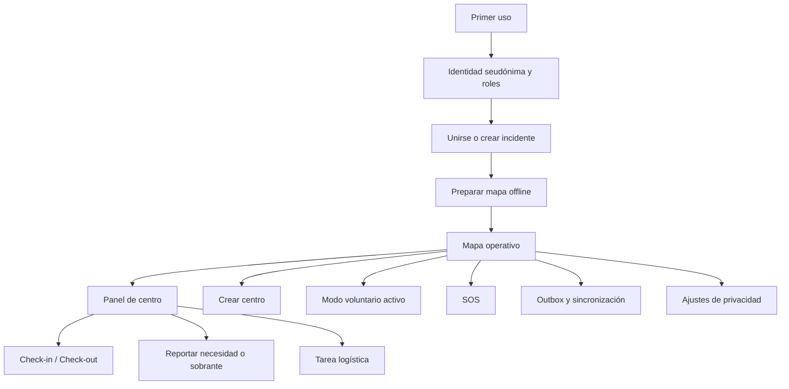

## 4. Sistema de estado transversal

Estos indicadores deben aparecer de forma consistente en las pantallas operativas.

| Estado | Representación | Dónde aparece |
|---|---|---|
| Conectividad | `Online`, `Offline`, `Parcial`, `Mesh queue` con icono y texto | Barra superior del mapa, outbox, SOS |
| Frescura | `Reciente`, `Degradado`, `Obsoleto` con timestamp | Centros, recursos, conteos, recomendaciones |
| Sync local | `Pendiente`, `Enviado`, `Confirmado`, `Conflicto`, `Rechazado` | Acciones recién creadas, outbox, detalle |
| Confianza | `Baja`, `Media`, `Alta` con explicación corta | Incidentes, centros, presencia, recursos, SOS y disputas |
| Riesgo | `Seguro`, `Precaución`, `Peligro`, `Solo roles entrenados` | Centros, rutas, recomendaciones |
| Tracking | `Activo`, `Degradado`, `Pausado`, `Detenido` | Mapa, modo voluntario, panel de centro |

## 5. Pantallas principales

## 5.1 Primer uso: identidad seudónima y roles

**Objetivo:** permitir operar sin email ni teléfono, generando identidad local y clave de firma.

### Layout

- Encabezado: `Zona Cero` + explicación corta: “Opera con seudónimo. Tus acciones críticas se firman localmente.”
- Campo principal: seudónimo por incidente.
- Selector de roles con chips grandes:
  - voluntario general,
  - rescate,
  - médico,
  - logística,
  - coordinación,
  - personal verificado.
- Aviso para roles sensibles: “Este rol necesita validación antes de desbloquear capacidades críticas.”
- CTA principal: `Crear identidad local`.
- CTA secundario: `Usar sin conexión`.

### Estados

| Estado | Diseño |
|---|---|
| Sin conexión | Permitir continuar; mostrar `La identidad se guardará en este dispositivo`. |
| Rol sensible seleccionado | Mostrar badge `Pendiente de validación`. |
| Clave creada | Confirmar con lenguaje simple: `Identidad lista. Operaciones firmadas activadas.` |

### Criterios de diseño

- No debe parecer un login tradicional.
- Debe explicar que perder el dispositivo puede implicar perder la identidad si no existe respaldo seguro.
- No debe pedir teléfono, email ni OAuth para voluntario civil.

---

## 5.2 Incidentes: unirse o crear

**Objetivo:** elegir el contexto operativo sin descargar datos innecesarios.

### Layout

- Barra superior: estado de conexión y última sync global.
- Lista priorizada de incidentes cercanos o recientes.
- Cada tarjeta muestra:
  - nombre,
  - zona aproximada,
  - estado: `Unverified`, `Community attested`, `Org verified`, `Archived`,
  - última actualización,
  - disponibilidad offline.
- CTA principal: `Unirse al incidente`.
- CTA secundario: `Crear incidente`.

### Crear incidente

Formulario mínimo:

- nombre,
- tipo aproximado de emergencia,
- zona aproximada,
- fecha/hora,
- nota breve.

Al crear, mostrar claramente: `Incidente no verificado`.

### Criterios de diseño

- Un incidente creado por usuario nace como `unverified`, con visibilidad/peso degradado si la confianza es baja.
- La pantalla debe sugerir posibles duplicados antes de crear uno nuevo y permitir corroborar o disputar reportes operativos existentes; además debe aplicar rate limits/throttling, penalización Sybil y degradación de visibilidad/peso cuando la confianza sea baja.
- No debe descargar todo el incidente; solo preparar celdas relevantes.

---

## 5.3 Preparar mapa offline

**Objetivo:** asegurar operación mínima antes de entrar en zona degradada.

### Layout

- Mapa miniatura con celda actual y celdas cercanas.
- Estado de paquetes:
  - `Descargado`,
  - `Parcial`,
  - `No disponible`,
  - `Actualización recomendada`.
- Estimación de tamaño y cobertura.
- CTA principal: `Descargar zona operativa`.
- CTA secundario: `Continuar con datos disponibles`.

### Estados

| Estado | Diseño |
|---|---|
| Sin red | Mostrar paquetes disponibles localmente y permitir continuar. |
| Descarga parcial | Mostrar progreso y cobertura parcial, no bloquear operación. |
| Mapa obsoleto | Mostrar advertencia, pero permitir uso si no hay alternativa. |

### Criterios de diseño

- Debe ser explícito qué zona se descarga.
- Debe evitar falsa seguridad: mapa descargado no significa datos operativos frescos.

---

## 5.4 Mapa operativo

**Objetivo:** ser la pantalla principal de decisión.

### Layout base

```text
┌────────────────────────────────────┐
│ Incidente · Celda · Online/Offline │
│ Frescura · Outbox · Tracking       │
├────────────────────────────────────┤
│                                    │
│              MAPA                  │
│  Centros · SOS · Recursos · Riesgo │
│                                    │
├────────────────────────────────────┤
│ Filtros rápidos                    │
│ [Crítico] [Mi rol] [SOS] [Obsoleto]│
├────────────────────────────────────┤
│ Estado voluntario + CTA principal  │
└────────────────────────────────────┘
```

### Capas del mapa

| Capa | Marcador |
|---|---|
| Centros pending | Pin con borde punteado + texto `Pendiente`. |
| Centros observing | Pin con pulso suave + texto `En observación`. |
| Centros active | Pin sólido + tipo de centro + déficit principal. |
| Centros resolved/archived | Ocultos por defecto; visibles por filtro histórico. |
| SOS | Marcador prioritario persistente con banner superior. |
| Necesidades críticas | Icono de recurso + severidad + frescura. |
| Sobrantes | Icono de recurso + disponibilidad aproximada. |
| Zonas saturadas | Área con patrón, no solo color. |
| Zonas peligrosas | Área con borde de advertencia + label textual. |

### Filtros rápidos

- `Necesidad crítica`.
- `Mi rol requerido`.
- `Centros cercanos`.
- `SOS`.
- `Datos obsoletos`.
- `Riesgo bajo`.
- `Recursos disponibles`.

### CTA principales

- `Crear centro`.
- `Estoy disponible` / `Cambiar estado`.
- `SOS` visible para cualquier participante civil, con confirmación y límites claros.

### Criterios de diseño

- El mapa debe funcionar aunque la sync esté pendiente.
- El usuario debe poder entender: dónde ir, dónde no ir, qué falta y qué tan confiable es la información.
- Color nunca es la única señal: cada estado requiere icono + texto.

---

## 5.5 Panel de centro seleccionado

**Objetivo:** decidir si ayudar, reportar, llevar recursos o evitar el centro.

### Layout compacto

```text
Centro: Escuela Norte
Estado: Active · Confianza alta · Datos recientes
Riesgo: Precaución · No entrar sin casco

Faltan: 3 médicos · agua · herramientas ligeras
Sobra: comida · mantas
Roles presentes: 12 total · 2 médicos · 4 logística

[Hacer check-in] [Llevar recurso] [Reportar]
```

### Secciones progresivas

1. **Resumen operativo**
   - tipo de centro,
   - estado,
   - confianza,
   - frescura,
   - riesgo.
2. **Necesidades y sobrantes**
   - categoría,
   - cantidad aproximada,
   - urgencia,
   - timestamp.
3. **Roles agregados**
   - conteos por rol,
   - nivel de confianza agregado,
   - sesiones obsoletas degradadas.
4. **Recomendación explicable**
   - “Recomendado porque falta apoyo médico y los datos son recientes.”
   - “No recomendado para voluntario general: zona marcada como peligrosa.”
5. **Acciones**
   - check-in,
   - checkout,
   - reportar necesidad,
   - reportar sobrante,
   - reportar duplicado/falso/peligroso/resuelto,
   - ver historial.

### Criterios de diseño

- No mostrar identidades individuales de voluntarios.
- Los reportes viejos deben verse degradados y perder peso visual.
- Las acciones críticas deben generar operación firmada y estado local inmediato.

---

## 5.6 Crear centro desde el mapa

**Objetivo:** crear un centro como check-in de campo, no como formulario pesado.

### Flujo

1. Usuario mantiene pulsado en el mapa o toca `Crear centro`.
2. La app propone ubicación aproximada.
3. Usuario elige tipo de centro.
4. Añade descripción breve y prioridad.
5. Opcional: necesidades iniciales.
6. Confirma creación.
7. El centro aparece localmente como reporte operativo `pending`/no verificado con sync pendiente.

### Formulario mínimo

- tipo:
  - rescate,
  - reparto,
  - puesto médico,
  - almacén temporal,
  - coordinación,
  - otro.
- descripción breve,
- prioridad,
- necesidad inicial opcional,
- riesgo visible si aplica.

### Confirmación

Mostrar:

- `Centro reportado en este dispositivo`.
- `Estado: pending`.
- `Se activará solo con evidencia suficiente`.
- `Operación firmada pendiente de sincronización` si no hay red.

### Criterios de diseño

- GPS por sí solo no debe comunicar “centro activo”.
- Crear centro no debe sacar al usuario del mapa y debe aplicar deduplicación, rate limits/throttling, penalización Sybil, disputas y degradación de visibilidad/peso cuando la confianza sea baja.
- La pantalla debe invitar a corroboración o disputa sin gamificarla ni convertir votos en permisos.

---

## 5.7 Modo voluntario activo

**Objetivo:** mostrar disponibilidad, tracking y control de presencia de forma explícita.

### Layout

- Tarjeta fija inferior en el mapa.
- Estado principal:
  - `Disponible`,
  - `Ocupado`,
  - `Descansando`,
  - `Fuera de servicio`.
- Tracking:
  - `Activo`,
  - `Degradado`,
  - `Pausado`,
  - `Detenido`.
- Centro asociado si existe.
- Batería y política de heartbeat cuando aplique.
- Acciones:
  - `Pausar tracking`,
  - `Check-out`,
  - `Cambiar estado`,
  - `Ir fuera de servicio`.

### Estados críticos

| Estado | Diseño |
|---|---|
| Tracking activo | Indicador persistente; explicar que genera evidencia de presencia. |
| Tracking degradado | Mostrar causa: batería, sensores, permisos o conectividad. |
| Pausado | Confirmar que no se pierden operaciones ya firmadas. |
| Off-duty | Retirar de conteos operativos tras TTL/frescura. |

### Criterios de diseño

- El tracking nunca debe sentirse oculto.
- Pausar o salir debe ser fácil; no puede estar enterrado en ajustes.
- La app debe explicar que presencia es confianza, no certeza.

---

## 5.8 Reportar necesidad o sobrante

**Objetivo:** registrar recursos en lenguaje operativo simple y comparable.

### Layout

- Encabezado: centro asociado y frescura.
- Selector: `Necesidad` o `Sobrante`.
- Categoría configurable:
  - roles/personas,
  - agua,
  - comida,
  - herramientas ligeras,
  - maquinaria pesada,
  - vehículos,
  - apoyo médico.
- Cantidad aproximada, nunca precisión falsa.
- Urgencia.
- Restricciones:
  - requiere rol entrenado,
  - acceso difícil,
  - zona peligrosa,
  - horario limitado.
- CTA: `Guardar reporte firmado`.

### Criterios de diseño

- Los reportes deben mostrar frescura, confianza, corroboraciones y disputas en el panel del centro.
- La app no debe parecer marketplace comercial.
- El matching debe presentarse como despacho humanitario asistido.

---

## 5.9 Recomendaciones de ayuda

**Objetivo:** orientar sin convertir la app en una autoridad ciega.

### Layout

- Tarjetas cortas sobre el mapa o en una hoja inferior.
- Cada recomendación muestra:
  - destino,
  - razón principal,
  - distancia aproximada,
  - riesgo,
  - frescura,
  - acción sugerida.

### Ejemplos de copy

- `Recomendado: faltan médicos y los datos son recientes.`
- `Evitar: centro saturado para voluntariado general.`
- `Precaución: zona peligrosa, requiere rol de rescate.`
- `Datos obsoletos: confirmar antes de desplazarte.`

### Criterios de diseño

- Debe ser apoyo a la decisión, no orden.
- Debe explicar la razón: déficit, recurso, distancia, frescura, saturación o riesgo.
- IA/ML no debe aparecer como promesa en MVP.

---

## 5.10 SOS

**Objetivo:** emitir y propagar una alerta crítica con mínima fricción y máxima claridad.

### Acceso

- Botón persistente para cualquier participante civil.
- Acceso desde mapa y modo voluntario activo, con deduplicación, rate limits/throttling, penalización Sybil, disputas posteriores, degradación de visibilidad/peso cuando la confianza sea baja y confirmación fuerte.

### Flujo

1. Usuario toca `SOS`.
2. Pantalla de confirmación breve con cuenta regresiva cancelable.
3. Se crea `sos.create` firmado.
4. Se muestra estado de propagación:
   - local,
   - sync backend,
   - cola Meshtastic,
   - ACK recibido.

### Layout de alerta recibida

- Banner superior persistente.
- Última ubicación conocida.
- Hora y radio de precisión.
- Centro asociado.
- Estado de batería si disponible.
- Botones:
  - `Acusar recibo`,
  - `Ver en mapa`,
  - `Marcar en respuesta`,
  - `Resolver` si permiso aplica.

### Criterios de diseño

- Nunca mostrar profundidad exacta bajo escombros.
- Debe mostrar timestamp y precisión/radio, no falsa exactitud.
- SOS offline debe quedar claramente en cola crítica.

---

## 5.11 Outbox y sincronización

**Objetivo:** dar confianza al usuario de que sus acciones no se pierden.

### Layout

- Resumen superior:
  - operaciones pendientes,
  - última sync,
  - conflictos,
  - cola crítica.
- Lista de operaciones:
  - tipo,
  - entidad,
  - estado,
  - hora local,
  - intento de sync.
- Filtros:
  - pendientes,
  - conflictos,
  - rechazadas,
  - críticas.

### Estados

| Estado | Copy |
|---|---|
| Pendiente | `Guardado localmente. Se enviará cuando haya conexión.` |
| Enviado | `Enviado. Esperando confirmación.` |
| Confirmado | `Confirmado por la red.` |
| Conflicto | `Requiere revisión. Tu historial se conserva.` |
| Rechazado | `No aplicado. Ver motivo.` |

### Criterios de diseño

- No asustar al usuario por operar offline.
- Sí debe mostrar conflictos/rechazos de forma honesta.
- La auditoría debe ser visible sin convertir la pantalla en consola técnica.

---

## 5.12 Privacidad y seguridad

**Objetivo:** controlar identidad, ubicación, datos sensibles y roles.

### Secciones

1. **Identidad local**
   - seudónimo por incidente,
   - clave local activa,
   - advertencia sobre recuperación.
2. **Ubicación**
   - aproximada por defecto,
   - opt-in reversible para exacta propia,
   - explicación de límites.
3. **Roles**
   - autodeclarados,
   - atestados,
   - org_verified si aplica.
4. **Datos locales**
   - paquetes offline,
   - TTL,
   - borrar datos del incidente.
5. **Reunificación familiar**
   - si feature flag habilitado, mostrar acceso restringido y advertencias.

### Criterios de diseño

- La ubicación exacta propia requiere opt-in explícito y reversible.
- Nunca permitir compartir ubicación exacta de menores o terceros.
- Los roles verificados deben separarse de la identidad civil seudónima.

---

## 5.13 Reunificación familiar preparada, no MVP público

**Objetivo:** dejar la arquitectura visual preparada sin activar un flujo inseguro.

### Estado en MVP

- No aparece como flujo general en navegación principal.
- Puede existir pantalla restringida detrás de feature flag y rol `org_verified`.
- Debe comunicar: `La app no autoriza entrega de menores`.

### Pantalla restringida futura

- Búsqueda privada con datos que el familiar ya conoce.
- Resultado limitado.
- Derivación a punto seguro/verificado.
- Auditoría de intento.
- TTL visible.

### Criterios de diseño

- No mostrar fotos públicas de menores.
- No mostrar ubicación exacta.
- No permitir reclamación por coincidencia de datos.

## 6. Componentes base

| Componente | Uso |
|---|---|
| `OperationalStatusBar` | Incidente, celda, conexión, frescura, outbox y tracking. |
| `MapLayerToggleSheet` | Filtros rápidos y capas operativas. |
| `CenterMarker` | Estado, tipo, déficit, riesgo y frescura. |
| `SelectedCenterPanel` | Resumen progresivo del centro. |
| `FreshnessBadge` | Reciente/degradado/obsoleto con timestamp. |
| `ConfidenceBadge` | Baja/media/alta con explicación. |
| `RiskLabel` | Riesgo textual + icono + confirmación si aplica. |
| `SignedActionToast` | Confirmación de operación firmada y estado sync. |
| `VolunteerStatusCard` | Disponibilidad y tracking. |
| `CriticalActionButton` | SOS, checkout, pausa tracking y navegación peligrosa. |
| `OutboxListItem` | Estado de operación local/remota. |

## 7. Jerarquía visual recomendada

1. **Crítico:** SOS, peligro, conflictos graves, navegación a zona peligrosa.
2. **Operativo inmediato:** recomendación, déficit crítico, check-in/check-out, tracking.
3. **Contexto:** frescura, confianza, sync, estado de incidente/celda.
4. **Detalle:** historial, auditoría, configuración avanzada.

## 8. Copy operativo recomendado

| Situación | Copy recomendado |
|---|---|
| Centro pendiente | `Pendiente: falta evidencia suficiente.` |
| Centro en observación | `En observación: hay señales coherentes, aún no confirmado.` |
| Centro activo | `Activo: evidencia suficiente para operar.` |
| Datos obsoletos | `Datos obsoletos. Confirma antes de desplazarte.` |
| Check-in offline | `Check-in guardado localmente y firmado.` |
| Tracking degradado | `Tracking degradado. Usaremos check-ins explícitos si hace falta.` |
| Riesgo alto | `Zona peligrosa. Confirma que tienes rol y equipo adecuados.` |
| Recomendación | `Sugerencia, no orden. Decide según seguridad en campo.` |

## 9. Flujos críticos

## 9.1 Crear centro offline

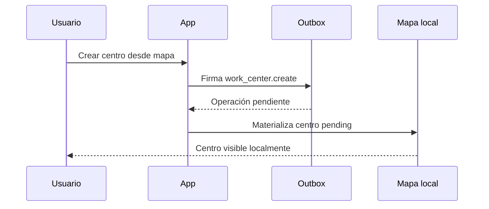

## 9.2 Check-in y presencia

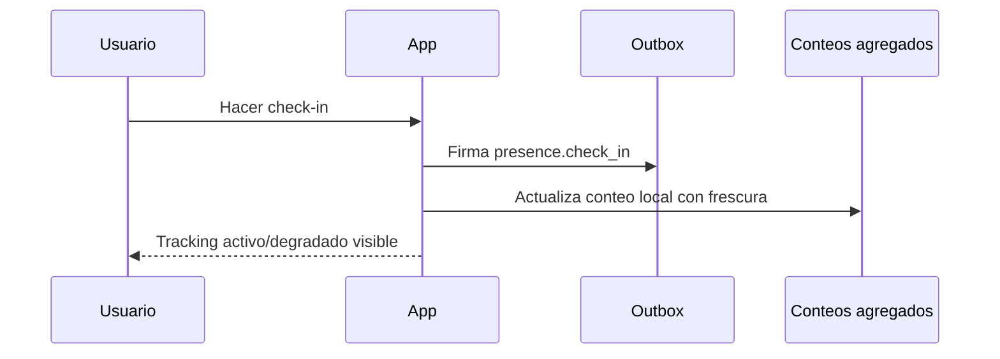

## 9.3 SOS offline

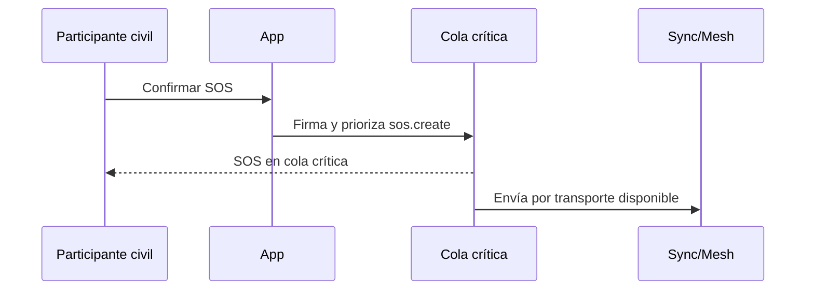

## 10. Checklist de aceptación de diseño

- [ ] El mapa es la superficie principal después de seleccionar incidente.
- [ ] Offline, frescura, sync y tracking son visibles sin abrir ajustes.
- [ ] Crear centro funciona como acción rápida desde mapa.
- [ ] Un centro creado aparece como `pending`, no como activo.
- [ ] El panel de centro muestra roles agregados, necesidades, sobrantes, confianza, frescura y riesgo.
- [ ] Las recomendaciones explican su razón y no se presentan como órdenes.
- [ ] Los estados no dependen solo del color.
- [ ] SOS está disponible para participantes civiles y muestra última ubicación conocida, hora y precisión/radio, nunca profundidad exacta ni promesa de rescate.
- [ ] El usuario puede pausar tracking, hacer check-out o quedar fuera de servicio de forma visible.
- [ ] La outbox confirma que las operaciones offline se conservaron y firmaron.
- [ ] Reunificación familiar no aparece como flujo público del MVP.
- [ ] La ubicación exacta propia requiere opt-in reversible.

## 11. Próximo paso recomendado

Convertir este documento en wireframes de baja fidelidad para las pantallas:

1. Mapa operativo.
2. Panel de centro seleccionado.
3. Crear centro desde mapa.
4. Modo voluntario activo.
5. SOS.
6. Outbox y sincronización.

Estas seis pantallas validan el corazón del producto. Lo demás puede crecer después. Primero hay que clavar el flujo operativo; si eso falla, la app entera se convierte en burocracia con mapa, justo lo que el PRD dice que NO hay que construir.

## 12. Visual mockups

These generated mockups are directional references for visual hierarchy and interaction emphasis. They are not final implementation assets.

Mockups are stored under `docs/mockups/screens/`, named after the screen they represent. Contact sheets live under `docs/mockups/contact-sheets/`.

| Screen | Image |
|---|---|
| Identity and roles | `docs/mockups/screens/identity-and-roles.png` |
| Incident selection | `docs/mockups/screens/incident-selection.png` |
| Offline map preparation | `docs/mockups/screens/offline-map-preparation.png` |
| Operational map | `docs/mockups/screens/operational-map.png` |
| Selected center panel | `docs/mockups/screens/selected-center-panel.png` |
| Create work center | `docs/mockups/screens/create-work-center.png` |
| Active volunteer mode | `docs/mockups/screens/active-volunteer-mode.png` |
| Resource report | `docs/mockups/screens/resource-report.png` |
| Recommendations | `docs/mockups/screens/recommendations.png` |
| SOS and outbox | `docs/mockups/screens/sos-and-outbox.png` |
| Logistics task | `docs/mockups/screens/logistics-task.png` |
| Sync conflict detail | `docs/mockups/screens/sync-conflict-detail.png` |
| Report center issue | `docs/mockups/screens/report-center-issue.png` |
| Privacy and security | `docs/mockups/screens/privacy-and-security.png` |
| Main screens contact sheet | `docs/mockups/contact-sheets/main-screens-contact-sheet.png` |
| Secondary screens contact sheet | `docs/mockups/contact-sheets/secondary-screens-contact-sheet.png` |

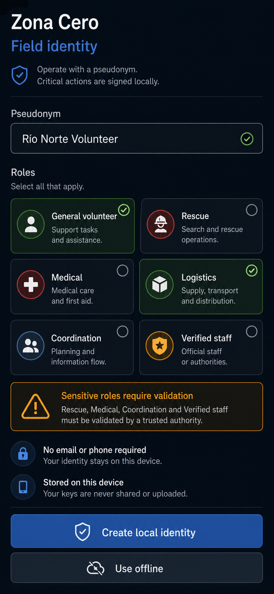

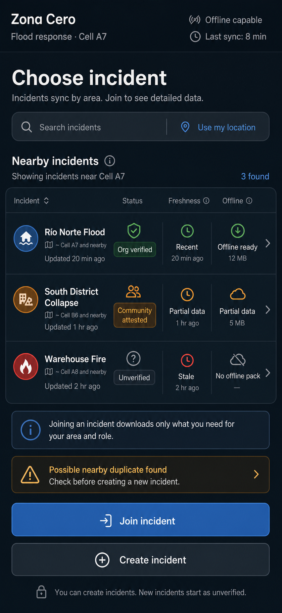

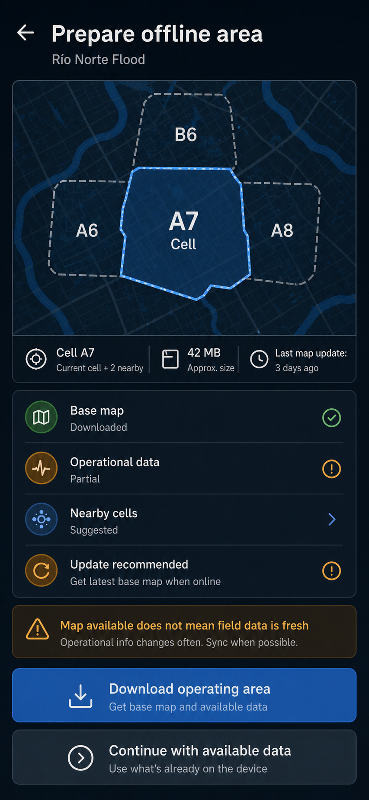

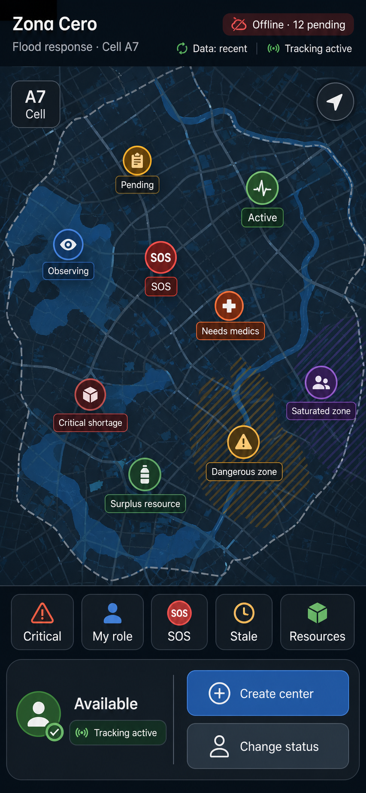

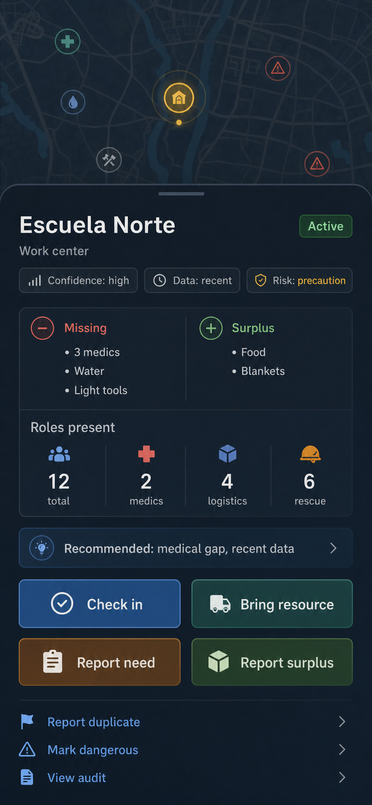

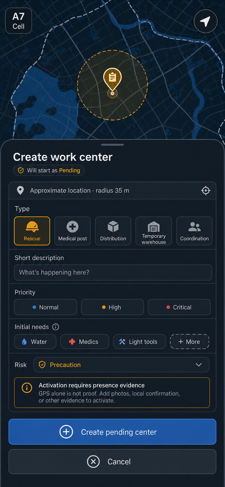

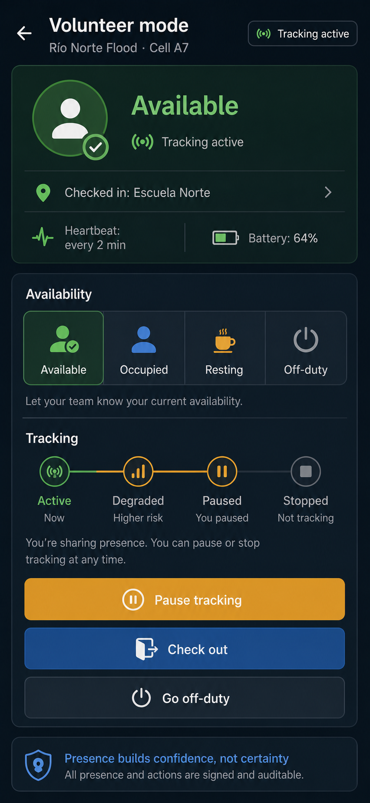

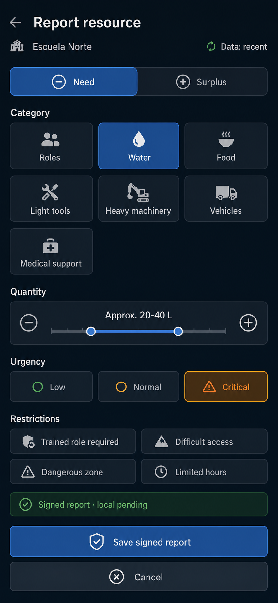

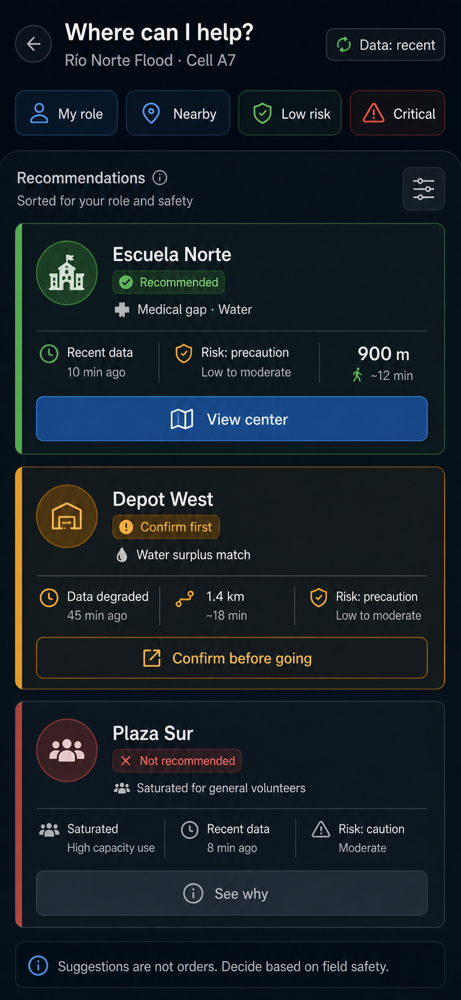

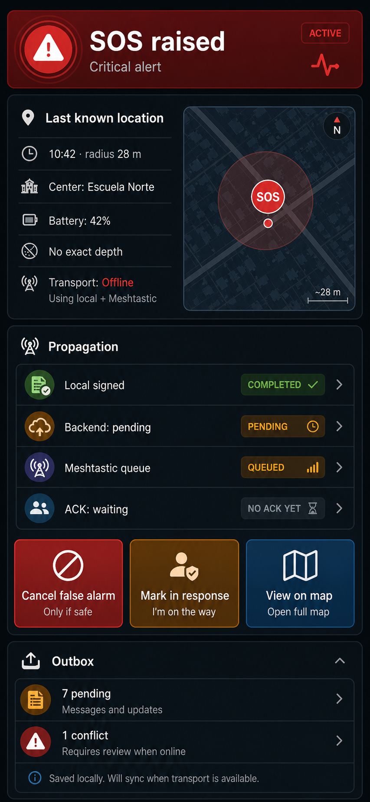

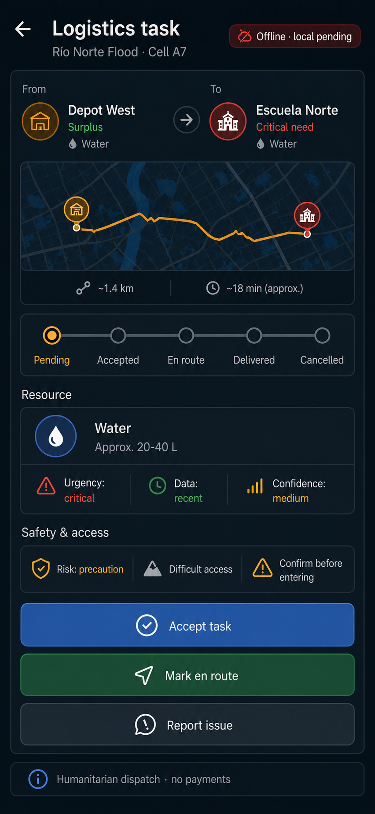

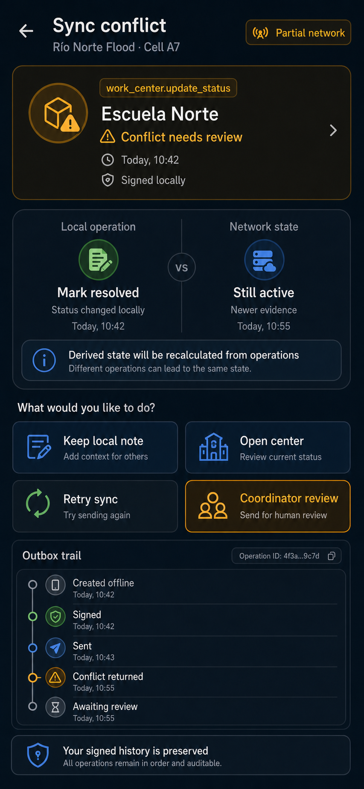

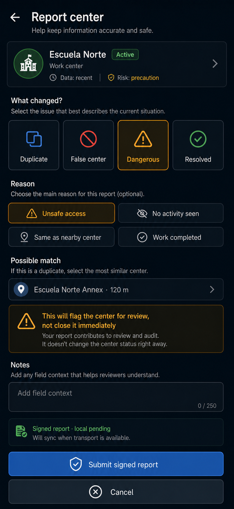

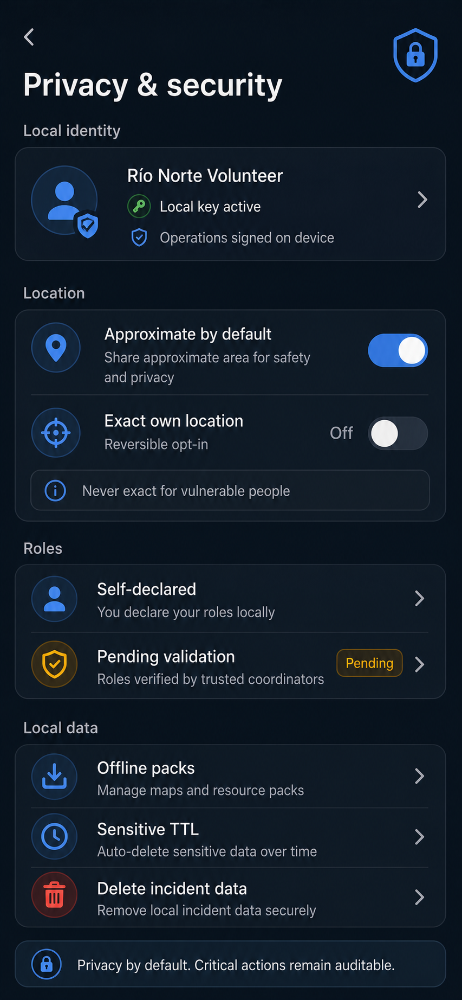


## 13. Adaptive day/night theme

Zona Cero should support an adaptive operational theme, not a single dark UI.

| Mode | Purpose | Rule |
|---|---|---|
| Day mode | Field use under sunlight or bright environments. | Light surfaces, dark text, strong borders, high-contrast status colors, and readable map layers. |
| Night mode | Low-light operation and reduced eye strain. | Dark surfaces, softened map layers, bright status labels, and controlled SOS/risk emphasis. |
| Automatic | Match user context when reliable. | Follow system theme, time of day, and ambient brightness when available. |
| Manual override | Safety fallback. | User can force `Day`, `Night`, or `Automatic` because field conditions can beat sensor assumptions. |

Initial day-mode validation mockups:

| Screen | Day mode image |
|---|---|
| Operational map | `docs/mockups/day-mode/operational-map-day.png` |
| Selected center panel | `docs/mockups/day-mode/selected-center-panel-day.png` |
| SOS and outbox | `docs/mockups/day-mode/sos-and-outbox-day.png` |
| Day mode contact sheet | `docs/mockups/day-mode/day-mode-contact-sheet.png` |

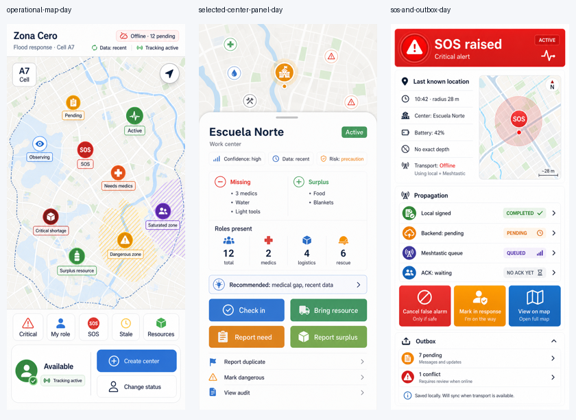

Day-mode v2 applies the selected surface hierarchy: stable light background, elevated white cards, muted nested surfaces, stronger borders, and subtle shadow.

| Screen | Day mode v2 image |
|---|---|
| Operational map | `docs/mockups/day-mode/operational-map-day-v2.png` |
| Selected center panel | `docs/mockups/day-mode/selected-center-panel-day-v2.png` |
| SOS and outbox | `docs/mockups/day-mode/sos-and-outbox-day-v2.png` |
| Day mode v2 contact sheet | `docs/mockups/day-mode/day-mode-v2-contact-sheet.png` |

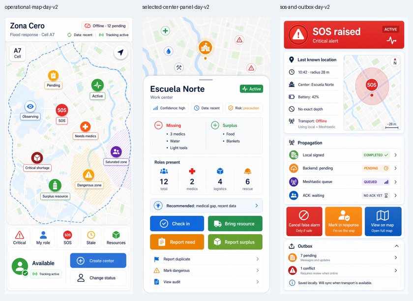
