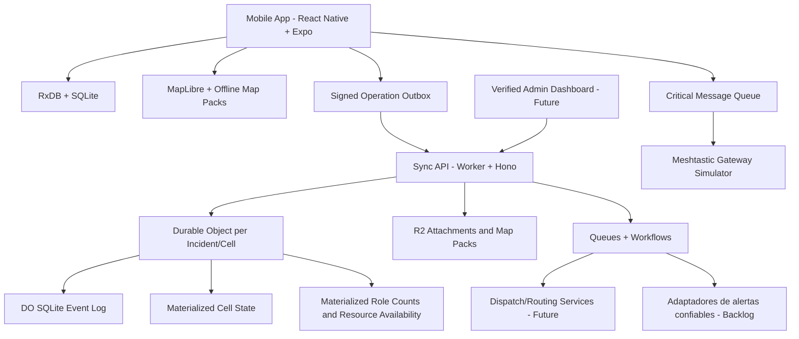

# Technical Design - Zona Cero

**Producto:** Zona Cero  
**Tipo:** Aplicación móvil local-first para coordinación ciudadana en catástrofes  
**Fecha:** 2026-06-27  
**Estado:** Borrador técnico v0.1  
**Fuentes:** `docs/zona_cero_prd_funcional.md`, `docs/Plan.md`, `docs/research/zona_cero_benchmark_tecnico_2026-06-27.md`

Zona Cero debe construirse como una red local-first por incidente/celda, no como una app CRUD con mapa. El núcleo técnico es una app móvil capaz de operar sin red, registrar operaciones firmadas, sincronizar por zona, mostrar mapas offline y tratar la presencia física como evidencia probabilística.

## 1. Decisiones cerradas

| Área | Decisión |
|---|---|
| Piloto | MVP multi-país desde el inicio; todo debe ser configurable por región/incidente. |
| Reunificación familiar | Arquitectura preparada, sin flujo operativo real hasta existir organismo verificador. |
| Identidad civil | Seudónimo local por incidente + clave Ed25519; sin email/teléfono obligatorio. |
| Incidentes | Cualquier usuario puede crear incidentes, pero nacen como `unverified`. |
| Datos offline | Mínimo operativo por incidente/celda; TTL agresivo para datos sensibles. |
| Meshtastic | Protocolo y gateway simulado en MVP; hardware real no bloquea el spike. |
| Riesgo para voluntarios | Recomendaciones con advertencias visibles; se acepta riesgo con mitigaciones. |
| Ubicación | Aproximada por defecto; opt-in reversible para compartir ubicación exacta propia. |
| Primer spike | Offline-first end-to-end: RxDB + SQLite + outbox firmada + sync mínimo. |
| Roles sensibles | Autodeclaración + atestación social; permisos críticos solo con `org_verified`. |
| Recomendaciones MVP | Motor determinístico, explicable y auditable; AI/ML solo después de validación de campo, observabilidad y override humano. |
| Evidencia multimedia | Solo backlog/feature flag; requiere redacción, TTL, cuotas, moderación, metadatos firmados y política de acceso. |

## 2. Objetivos técnicos

- Permitir operación útil sin conectividad.
- Mantener auditoría local y remota mediante operaciones firmadas.
- Sincronizar por incidente/celda para limitar coste, exposición y conflictos.
- Evitar que GPS sea tratado como prueba absoluta de presencia.
- Minimizar datos personales y exposición de ubicaciones sensibles.
- Preparar interoperabilidad con PFIF/RFL sin activar reunificación real de menores.
- Preparar transporte de mensajes críticos vía gateway Meshtastic.
- Separar identidad civil seudónima de identidad verificada organizacional.
- Soportar umbrales de validación configurables por incidente, materializaciones de conteos por rol, vistas de disponibilidad de recursos y sesiones activas de presencia.
- Mantener ingesta de alertas confiables, evidencia multimedia, soporte de adultos desaparecidos y recomendaciones de IA detrás de validación/backlog o feature flags hasta contar con gobernanza y controles de seguridad.

## 3. Stack recomendado

| Capa | Decisión | Motivo |
|---|---|---|
| App móvil | React Native + Expo Development Builds + TypeScript | Acceso nativo, ecosistema móvil, velocidad de desarrollo. |
| Navegación | Expo Router | Convención simple y mantenible. |
| Base local | RxDB + SQLite/expo-sqlite | Documentos reactivos, persistencia local y base para replicación propia. |
| Outbox | Cola append-only propia | Firmas, auditoría, idempotencia y control de conflictos. |
| Mapas | MapLibre React Native + OSM offline packs | Evita dependencia fuerte de proveedores online. |
| Backend API | Cloudflare Workers + Hono | Edge, simplicidad operativa y coste bajo. |
| Coordinación estado | Durable Objects por incidente/celda | Consistencia eventual acotada por zona. |
| Estado caliente | Durable Object SQLite | Event log y materializaciones por celda. |
| Assets | R2 | Adjuntos, paquetes de mapas y exportaciones. |
| Jobs | Queues + Workflows | Procesamiento asíncrono y tareas pesadas. |
| Recomendaciones | Motor de reglas determinístico en MVP | Sugerencias de despacho explicables antes de IA/ML. |
| Ingesta futura de alertas | Adaptadores de proveedor para feeds oficiales | Solo alertas confiables; sin scraping social/noticias para pushes críticos de seguridad por defecto. |
| Auth verificada | Better Auth solo para personal/orgs | No aplica a voluntarios civiles anónimos. |
| Routing futuro | OSRM/Valhalla + VROOM/OR-Tools | Rutas y optimización fuera del MVP base. |

## 4. Arquitectura de alto nivel



## 5. Mobile architecture

### 5.1 Capas internas

| Capa | Responsabilidad |
|---|---|
| `ui` | Map-first screens, selected-center panel, navigation, active status controls, visual states, and accessibility. |
| `features` | Casos de uso por módulo: incidentes, centros, presencia, recursos, recomendaciones, SOS. |
| `domain` | Entidades, reglas de negocio, estados y políticas. |
| `local-db` | RxDB collections, índices, migraciones y materializaciones locales. |
| `oplog` | Creación, firma, persistencia y reintento de operaciones. |
| `sync` | Push/pull por incidente/celda y resolución de cursores. |
| `security` | Claves, firmas, cifrado local, permisos y sanitización. |
| `maps` | Offline packs, capas, geoceldas y representación de frescura. |
| `transport` | Sincronización backend, gateway simulado Meshtastic, cola crítica y futuros adaptadores de alertas confiables. |

### 5.2 Principio de escritura

Ninguna mutación crítica escribe solo una tabla de estado. Toda acción debe generar una operación firmada en la outbox y luego actualizar vistas/materializaciones locales.

Ejemplo:

1. Usuario crea un centro.
2. App crea `work_center.create` en `sync_ops`.
3. App firma la operación.
4. Materializador local actualiza `work_centers`.
5. Sync sube la operación cuando puede.
6. Backend valida firma, idempotencia y permisos.
7. Otros clientes descargan la operación por cursor.

## 6. Modelo local de datos

### 6.1 Colecciones RxDB iniciales

| Colección | Uso | Offline |
|---|---|---|
| `incidents` | Incidentes conocidos, estado de confianza y configuración regional. | Sí |
| `incident_cells` | Celdas geográficas y estado de sincronización. | Sí |
| `work_centers` | Vista materializada de centros, confidence, risk labels, freshness, and selected-center summary fields. | Sí |
| `center_role_counts` | Materialized aggregate role counts per center/cell, derived from active presence sessions and role trust level. | Sí, TTL/freshness |
| `presence_sessions` | Active presence sessions with availability state, heartbeat policy, score, pause/checkout timestamps, and battery-aware metadata. | Sí, TTL |
| `resource_reports` | Faltantes/sobrantes by configurable category, quantity/status, urgency, restrictions, freshness, and confidence. | Sí, TTL |
| `resource_availability` | Materialized resource matrix per center/cell for needs, surplus, matching, and selected-center panels. | Sí, TTL/freshness |
| `dispatch_jobs` | Tareas logísticas simples. | Sí |
| `sos_alerts` | Alertas críticas y ACKs. | Sí, prioridad alta |
| `role_claims` | Roles autodeclarados. | Sí |
| `role_attestations` | Atestaciones sociales de rol. | Sí, TTL/reputación |
| `family_records_public` | Metadatos mínimos preparados para reunificación. | Solo si módulo habilitado en entorno controlado |
| `family_records_private` | Datos cifrados, no operativos en MVP público. | Restringido |
| `attachments` | Backlog/feature-flagged signed metadata for optional media evidence with redaction state, TTL, quota, moderation, and access policy. | Limitado |
| `recommendation_explanations` | Auditable reasons for deterministic dispatch/resource suggestions. | Sí, TTL |
| `trusted_alert_events` | Future official-provider alerts after adapter validation and deduplication. | Feature flag |
| `missing_adult_records` | Future bounded context for adult last-seen/found records with public/private split. | Feature flag, restricted |
| `sync_ops` | Outbox/inbox append-only de operaciones firmadas. | Sí |
| `sync_cursors` | Cursores por incidente/celda. | Sí |
| `settings` | Preferencias locales, idioma, privacidad. | Sí |

### 6.2 Política offline

- Descargar solo la celda actual y celdas adyacentes necesarias.
- Mantener datos sensibles con TTL agresivo.
- Guardar ubicación exacta propia solo si el usuario hace opt-in explícito.
- Nunca permitir opt-in para revelar ubicación exacta de menores, terceros o puntos sensibles.
- Mostrar frescura de datos en UI: reciente, degradado, obsoleto.

## 7. Operaciones firmadas

### 7.1 Esquema base

```ts
type SignedOperation = {
  op_id: string;
  op_version: 1;
  actor_key: string;
  device_id: string;
  incident_id: string;
  geo_cell: string;
  entity_type: string;
  entity_id: string;
  op_type: string;
  payload: unknown;
  hlc: string;
  created_at_device: string;
  previous_op_ids?: string[];
  signature: string;
};
```

### 7.2 Reglas

- `op_id` debe ser determinístico o UUID seguro y único.
- La firma debe cubrir todos los campos relevantes salvo `signature`.
- El backend debe rechazar operaciones con firma inválida.
- Las operaciones deben ser idempotentes.
- Los estados derivados se recalculan desde operaciones cuando sea necesario.
- No usar last-write-wins global para entidades críticas.

### 7.3 Tipos iniciales de operación

| Tipo | Descripción |
|---|---|
| `incident.create` | Crea incidente `unverified`. |
| `incident.attest_duplicate` | Sugiere duplicado/fusión. |
| `incident.verify` | Promueve incidente por organización verificada. |
| `work_center.create` | Crea centro `pending`. |
| `work_center.update_status` | Cambia estado con evidencia. |
| `work_center.report_duplicate` | Reporta posible duplicado. |
| `presence.check_in` | Inicia presencia. |
| `presence.pause` | Pausa presencia offline. |
| `presence.check_out` | Cierra presencia. |
| `resource_report.create` | Reporta faltante o sobrante; el payload distingue el estado. |
| `dispatch_event.create` | Crea evento de dispatch. |
| `dispatch_event.update` | Actualiza evento de dispatch. |
| `sos.create` | Emite SOS. |
| `sos.cancel` | Cancela SOS local cuando corresponde. |
| `role.claim` | Rol autodeclarado. |
| `role.attest` | Atestación social de rol. |
| `role.org_verify` | Validación por organización. |

## 8. Sincronización

### 8.1 Scope

La sincronización opera por:

- `incident_id`
- `geo_cell`
- cursor HLC/Lamport
- tipo de entidad cuando haga falta priorización

### 8.2 API mínima

```http
POST /sync/push
GET  /sync/pull?incident_id=...&geo_cell=...&cursor=...
GET  /sync/status?incident_id=...&geo_cell=...
```

### 8.3 Push

El cliente envía lote de operaciones firmadas pendientes. El servidor responde por operación:

- `accepted`
- `duplicate`
- `rejected_signature`
- `rejected_policy`
- `conflict_needs_review`

### 8.4 Pull

El cliente pide operaciones nuevas desde su cursor por incidente/celda. El servidor devuelve operaciones ordenadas por HLC y metadatos de frescura.

### 8.5 Priorización

Orden de prioridad para sincronización:

1. SOS y ACKs.
2. Cambios de centros activos o peligrosos.
3. Faltantes críticos.
4. Presencia y roles.
5. Datos administrativos no urgentes.

## 9. Incidentes multi-país

### 9.1 Estados

| Estado | Significado |
|---|---|
| `unverified` | Creado por usuario civil; útil pero no respaldado oficialmente. |
| `community_attested` | Varias señales sociales/geográficas lo respaldan. |
| `org_verified` | Validado por organización o autoridad. |
| `merged` | Fusionado con otro incidente. |
| `archived` | Cerrado o caducado. |

### 9.2 Requisitos técnicos

- Detectar duplicados por proximidad, tiempo, nombre, tipo de desastre y solape de celdas.
- Permitir sugerencias de fusión sin borrar historial.
- Mostrar claramente el estado de confianza del incidente.
- Permitir configuración regional por incidente: idioma, TTL, umbrales, organismos, mapa base y restricciones legales.
- Store validation threshold configuration per incident, including dwell time, minimum distinct devices, peer corroboration weight, role trust weighting, stale-data decay, and suspicious-signal penalties.
- Treat any numeric threshold such as 5/10 users or 30/60 minutes as seed configuration for field trials, not a global constant.

## 9.3 Configuración por incidente

Incident configuration must drive validation and safety behavior instead of hard-coded global constants. Initial configurable groups:

| Config group | Examples | Purpose |
|---|---|---|
| Center validation | Dwell time, distinct devices, corroboration count, minimum confidence | Promote `pending -> observing -> active`. |
| Freshness decay | Need TTL, surplus TTL, role-count TTL, stale warning threshold | Prevent stale reports from driving dispatch. |
| Risk policy | Dangerous-zone labels, role restrictions, confirmation requirements | Avoid unsafe volunteer routing. |
| Resource taxonomy | Roles, water, food, light tools, heavy machinery, vehicles, medical support | Keep MVP simple while allowing local vocabulary. |
| Presence policy | Heartbeat interval, battery saver threshold, pause behavior | Balance confidence and battery drain. |

## 10. Presencia probabilística

### 10.1 Objetivo

Determinar confianza operativa, no verdad absoluta. GPS es una señal más.

### 10.2 Señales

| Señal | Peso inicial |
|---|---:|
| Geofence con precisión aceptable | Medio |
| Permanencia temporal | Alto |
| Dispositivos distintos | Alto |
| Historial local útil | Medio |
| Atestaciones cruzadas | Medio |
| Movimiento plausible | Medio |
| Señales anti-spoofing | Penalización |
| Reportes negativos | Penalización fuerte |

### 10.3 Niveles

| Nivel | Uso |
|---|---|
| `low` | No debe activar centros ni recomendaciones fuertes. |
| `medium` | Puede contribuir a observación. |
| `high` | Puede contribuir a centro activo junto con otras señales. |

### 10.4 Active presence sessions

Presence is modeled as an explicit session, not an invisible background tracker.

| Field | Purpose |
|---|---|
| `status` | `available`, `occupied`, `resting`, or `off-duty`. |
| `tracking_state` | `active`, `degraded`, `paused`, or `stopped`. |
| `battery_state` | Battery level/charging state when available, used to adapt heartbeat frequency. |
| `center_id` | Optional current center association. |
| `last_heartbeat_at` | Freshness for role counts and confidence. |
| `checked_out_at` | Explicit end of field participation. |

Heartbeats must be adaptive: lower frequency under battery pressure, poor sensor quality, or user pause; explicit check-ins/check-outs remain valid signed operations when background tracking is unavailable.

### 10.5 Anti-abuso

- Rate limits por dispositivo, actor y celda.
- Penalización por saltos imposibles.
- Detección de ubicaciones simuladas cuando el sistema operativo lo permita.
- Coste temporal para ganar peso.
- Ningún actor nuevo activa solo un centro crítico.

## 11. Roles y confianza

### 11.1 Niveles de rol

| Nivel | Fuente | Permisos |
|---|---|---|
| `self_declared` | Usuario se asigna rol. | Señal débil para filtros y disponibilidad. |
| `field_attested` | Otros usuarios co-presentes atestiguan. | Mayor peso en recomendaciones y conteos. |
| `trusted_by_context` | Historial útil, presencia y pocas disputas. | Peso operativo alto, sin permisos críticos. |
| `org_verified` | ONG/autoridad/admin verificado. | Permisos críticos y datos restringidos. |

### 11.2 Regla crítica

La atestación social no equivale a credencial profesional. Puede ayudar a priorizar confianza en campo, pero no debe desbloquear acceso a datos sensibles, verificación de menores ni capacidades administrativas críticas.

## 11.3 Materialized role counts

Role counts are derived views, not public lists of people. Materialization must aggregate active presence sessions by center, role, role trust level, freshness, and availability status. Stale or checked-out sessions must lose weight and eventually disappear from operational counts.

## 12. Ubicación y privacidad

### 12.1 Política por defecto

- Mostrar ubicación aproximada para usuarios civiles.
- Permitir opt-in explícito y reversible para compartir ubicación exacta propia.
- No permitir que un usuario exponga ubicación exacta de terceros.
- No publicar ubicación exacta de menores o personas vulnerables.
- SOS puede incluir última ubicación exacta conocida porque es una acción crítica explícita.

### 12.2 Riesgos aceptados

Se permite recomendar zonas peligrosas con advertencias visibles. Esta decisión queda marcada como riesgo aceptado, porque los warnings no sustituyen controles duros.

Mitigaciones mínimas:

- Etiquetas de riesgo prominentes.
- Confirmación explícita antes de navegar a zona peligrosa.
- Contexto de rol requerido.
- Auditoría de recomendaciones aceptadas.
- Revisión futura para bloqueo por rol/riesgo si hay señales de daño.

## 13. Mapas offline

### 13.1 MVP

- MapLibre React Native.
- Paquetes offline por región/incidente.
- Descarga manual y sugerida antes de entrar en zona.
- Capas locales para centros, recursos, SOS y frescura.
- Map-first composition with quick filters, active volunteer status, and selected-center side/bottom panel.
- Selected-center panel backed by materialized role counts, needs, surplus, freshness, confidence, and risk labels.

### 13.2 Evolución

- PMTiles/MBTiles regionales.
- Pipeline OSM con Planetiler/OpenMapTiles.
- CDN/R2 para distribución.
- Routing online primero; offline compacto en fase posterior.

## 13.3 Resource availability model

Resource reports are append-only operations materialized into availability views. The MVP must avoid overfitting taxonomy while supporting configurable categories.

| Field | Requirement |
|---|---|
| `category` | Incident-configurable; initial groups: roles, water, food, light tools, heavy machinery, vehicles, medical support. |
| `direction` | `need` or `surplus`. |
| `quantity` | Approximate count/range/unit, never false precision. |
| `urgency` | Operational priority for matching. |
| `freshness` | Derived from report time, sync state, and TTL decay. |
| `confidence` | Derived from reporter trust, presence confidence, and corroboration. |

Matching in MVP is deterministic: priority, compatibility, distance, safety, freshness, and confidence. Route optimization remains future work.

## 13.4 Recommendation engine

The MVP recommendation engine must be deterministic, explainable, and auditable. It should emit a recommendation plus reason codes such as role deficit, critical shortage, distance, freshness, saturation, and risk. AI/ML recommendations are future work only after there is enough field data, observability, bias/safety review, and human override.

## 14. Meshtastic gateway

### 14.1 MVP

El MVP no depende de hardware Meshtastic real. Debe implementar:

- Cola local de mensajes críticos.
- Formato compacto de mensaje.
- Gateway simulado para pruebas.
- ACK local/remoto.

### 14.2 Mensajes críticos

| Mensaje | Contenido mínimo |
|---|---|
| `SOS` | id, incidente, celda, última ubicación, hora, actor, firma/resumen. |
| `CENTER_ACTIVE` | centro, celda, estado, confianza, hora. |
| `CRITICAL_SHORTAGE` | centro, recurso, criticidad, hora. |
| `ACK` | mensaje original, receptor, hora. |

## 14.3 Ingesta de alertas confiables - backlog

La ingesta de alertas confiables es un elemento de backlog basado en adaptadores de proveedor. Solo fuentes oficiales o explícitamente confiables de protección civil, geología, meteorología o equivalentes pueden generar alertas críticas de seguridad. La capa de adaptadores debe soportar identidad de fuente, firma/procedencia cuando exista, localización, deduplicación, mapeo de severidad, TTL, logs de auditoría y override humano/operador. Redes sociales o scraping de noticias no deben disparar alertas de evacuación por defecto.

## 15. Reunificación familiar

### 15.1 Alcance MVP

Solo arquitectura preparada. No se habilita búsqueda/reclamación real de menores en MVP público.

### 15.2 Diseño preparado

- Modelo PFIF-compatible.
- Capa pública mínima.
- Capa privada cifrada.
- TTL y borrado programado.
- Auditoría de accesos e intentos.
- Roles `org_verified` para acceso restringido.
- Feature flag por incidente/región.

### 15.3 Contexto delimitado de adultos desaparecidos - futuro

El soporte para adultos desaparecidos debe ser un contexto delimitado separado y controlado por feature flag, no una expansión del flujo de entrega de menores. Debe soportar registros de último avistamiento/encontrado con separación de datos públicos/privados, TTL, logs de auditoría, rate limits, controles de acceso y revelado limitado. Registros de personas fallecidas, registros externos y notificaciones de último avistamiento requieren política e integración validadas por separado.

### 15.4 Regla no negociable

La app nunca autoriza entrega de menores. Solo puede generar pistas y derivar a verificación presencial por organismo competente.

## 15.5 Adjuntos de evidencia multimedia - backlog

La evidencia de daños mediante foto/video permanece detrás de feature flag hasta validar privacidad, moderación y coste de sincronización. Controles técnicos mínimos antes de habilitarlo:

- Minimización y redacción en cliente cuando sea viable.
- Metadatos de adjunto firmados y vinculados a la operación de origen.
- TTL y política de borrado por incidente y sensibilidad.
- Cuotas de almacenamiento offline y controles de prioridad de subida.
- Estado de moderación/revisión antes de visibilidad amplia.
- Política de acceso para distinguir quién puede ver medios originales frente a miniaturas redactadas o metadatos.

## 16. Seguridad

### 16.1 Controles

| Control | Decisión | Verificación |
|---|---|---|
| Autenticación civil | Clave local Ed25519 + seudónimo por incidente. | Test de generación/firma y persistencia segura. |
| Auth verificada | Better Auth para admins/orgs, separado de identidad civil. | Test de permisos y sesiones. |
| Autorización | Permisos por nivel de rol y estado de incidente. | Tests de matriz de permisos. |
| Protección de datos | Minimización, TTL, cifrado de datos sensibles. | Tests de expiración y revisión de almacenamiento. |
| Operaciones | Firmas obligatorias e idempotencia. | Tests de firma inválida, replay y duplicados. |
| Ubicación | Aproximada por defecto; opt-in propio exacto. | Tests de privacidad por entidad. |
| Logging | Auditoría de operaciones críticas sin exponer secretos. | Revisión de logs. |
| Secretos | Material criptográfico en Secure Store/Keychain/Keystore. | Revisión móvil y pruebas de extracción básica. |

### 16.2 Threat model inicial

| ID | Componente | Amenaza | Impacto | Mitigación |
|---|---|---|---|---|
| TM-001 | Presencia | GPS spoofing activa centros falsos. | Alto | Scoring probabilístico, permanencia, consenso, anti-spoofing. |
| TM-002 | Identidad | Ataque Sybil crea muchos voluntarios falsos. | Alto | Rate limits, coste temporal, reputación contextual, diversidad de señales. |
| TM-003 | Incidentes | Usuarios crean incidentes duplicados o falsos. | Medio/Alto | Estado `unverified`, detección duplicados, fusión, señales de confianza. |
| TM-004 | Ubicación | Doxxing o persecución de voluntarios. | Alto | Ubicación aproximada, opt-in propio, TTL y minimización. |
| TM-005 | Menores | Reclamación falsa de niño. | Crítico | Flujo real deshabilitado; solo org_verified; no entrega desde app. |
| TM-006 | Outbox | Replay o manipulación de operaciones. | Alto | Firmas, idempotencia, op_id único, validación backend. |
| TM-007 | Dispositivo perdido | Exposición de datos offline. | Alto | Datos mínimos por celda, TTL, cifrado sensible. |
| TM-008 | Meshtastic | Mensajes críticos falsos o repetidos. | Alto | Firma/resumen, ACK, deduplicación y prioridad auditada. |
| TM-009 | Evidencia multimedia | Imágenes sensibles se filtran, inducen a error o saturan la sincronización. | Alto | Feature flag, redacción, TTL, cuotas, moderación, metadatos firmados. |
| TM-010 | Alertas confiables | Una fuente no confiable genera pánico o rutas inseguras. | Crítico | Solo proveedores oficiales, procedencia, deduplicación, mapeo de severidad, auditoría, override humano. |
| TM-011 | Recomendaciones | Una sugerencia determinística o de IA dirige personas de forma insegura. | Alto | Reglas explicables, etiquetas de riesgo, elección humana, logs de auditoría, IA bloqueada hasta validación. |
| TM-012 | Adultos desaparecidos | Datos sensibles de último avistamiento facilitan acoso o persecución. | Alto | Contexto delimitado separado, TTL, control de acceso, rate limits, logs de auditoría. |

## 16.3 Adiciones a la estrategia de testing

Los tests deben cubrir los límites de producto que pueden causar daño real:

- Casos borde de activación de centros: un usuario único permanece `pending`; GPS por sí solo nunca activa; la validación co-presente solo cambia la confianza tras tiempo de permanencia; saltos sospechosos o ubicaciones simuladas penalizan la confianza.
- Reportes obsoletos: necesidades, sobrantes, conteos de rol y sesiones de presencia antiguas pierden peso de matching y muestran frescura degradada.
- Roles falsos: roles autodeclarados o socialmente atestados influyen en filtros/conteos pero no desbloquean permisos críticos ni datos sensibles.
- Límites de atestación social: reclamos coordinados entre pares no pueden otorgar capacidades `org_verified`.
- Matching de recursos: el matching determinístico respeta compatibilidad de categoría, urgencia, frescura, seguridad, distancia y confianza.
- Sin falsa precisión: SOS y visualizaciones de sensores muestran última ubicación conocida, timestamp y radio de precisión, nunca profundidad exacta bajo escombros.
- Feature flag de multimedia: los adjuntos permanecen ocultos/deshabilitados salvo que pasen checks de política, cuota, redacción, moderación, TTL y metadatos firmados.
- Adaptadores de alertas confiables: alertas no confiables o duplicadas no generan pushes críticos de seguridad.

## 17. Primer spike técnico

### 17.1 Objetivo

Demostrar el flujo offline-first end-to-end antes de invertir en UX avanzada.

### 17.2 Alcance

- App Expo Dev Build mínima.
- RxDB + SQLite funcionando en dispositivo.
- Generación de clave Ed25519 local.
- Creación de operaciones firmadas.
- Outbox append-only.
- Worker/Hono con endpoint `push/pull` mínimo.
- Durable Object por incidente/celda.
- Validación de firma e idempotencia.
- Materialización local de un centro creado offline.
- Simulación de pérdida y recuperación de conectividad.

### 17.3 Criterios de éxito

- Crear incidente `unverified` offline.
- Crear centro offline.
- Firmar ambas operaciones.
- Ver estado local inmediatamente.
- Sincronizar al recuperar red.
- Descargar la operación en un segundo cliente.
- Rechazar operación manipulada.
- Evitar duplicado por reintento.

## 18. Riesgos abiertos

| Riesgo | Estado | Acción |
|---|---|---|
| MVP multi-país aumenta complejidad legal y operativa. | Aceptado | Configuración por región/incidente desde el modelo. |
| Advertencias para zonas peligrosas pueden ser ignoradas. | Aceptado con preocupación | Medir uso y reconsiderar bloqueo por rol. |
| Atestación social puede ser manipulada. | Aceptado parcialmente | No desbloquear permisos críticos sin org_verified. |
| Las recomendaciones de IA pueden crear sesgo de autoridad inseguro. | Diferido | Usar primero reglas determinísticas explicables; exigir observabilidad, auditoría y override humano antes de IA. |
| La evidencia multimedia aumenta riesgo de privacidad, moderación, almacenamiento y sincronización. | Diferido | Mantener detrás de feature flag hasta probar controles. |
| Los feeds de alertas confiables pueden generar responsabilidad y pánico si las fuentes fallan. | Diferido | Solo adaptadores de proveedores oficiales/confiables, con procedencia y override. |
| El soporte de adultos desaparecidos puede exponer datos sensibles de último avistamiento. | Diferido | Contexto delimitado separado con TTL, controles de acceso y logs de auditoría. |
| RxDB + SQLite en Expo debe validarse temprano. | Pendiente | Spike técnico prioritario. |
| MapLibre offline puede tener diferencias iOS/Android. | Pendiente | Spike específico después del offline-first. |
| Meshtastic real puede requerir decisiones de hardware. | Diferido | Simular gateway; elegir hardware después. |

## 19. Decisiones que no deben reabrirse sin nueva evidencia

- No construir CRUD online-first.
- No tratar GPS como prueba.
- No activar reunificación real de menores sin organismo verificador.
- No exigir email/teléfono a voluntarios civiles.
- No descargar todo el incidente en dispositivos voluntarios por defecto.
- No desbloquear permisos críticos solo por popularidad social.
- No use social/news scraping for safety-critical alerts without trusted-provider validation.
- No enable AI recommendations, media evidence, or missing-adult records as authoritative MVP flows without feature flags, auditability, and policy review.
- No display exact rubble depth or sensor-derived false precision.

## 20. Próximo paso recomendado

Construir el spike `offline-first-end-to-end` y documentar resultados técnicos reales antes de diseñar pantallas avanzadas. La secuencia correcta es:

1. Outbox firmada.
2. Sync mínimo por incidente/celda.
3. Materialización local/remota.
4. Mapa offline.
5. Presencia probabilística.
6. Meshtastic gateway simulado.
